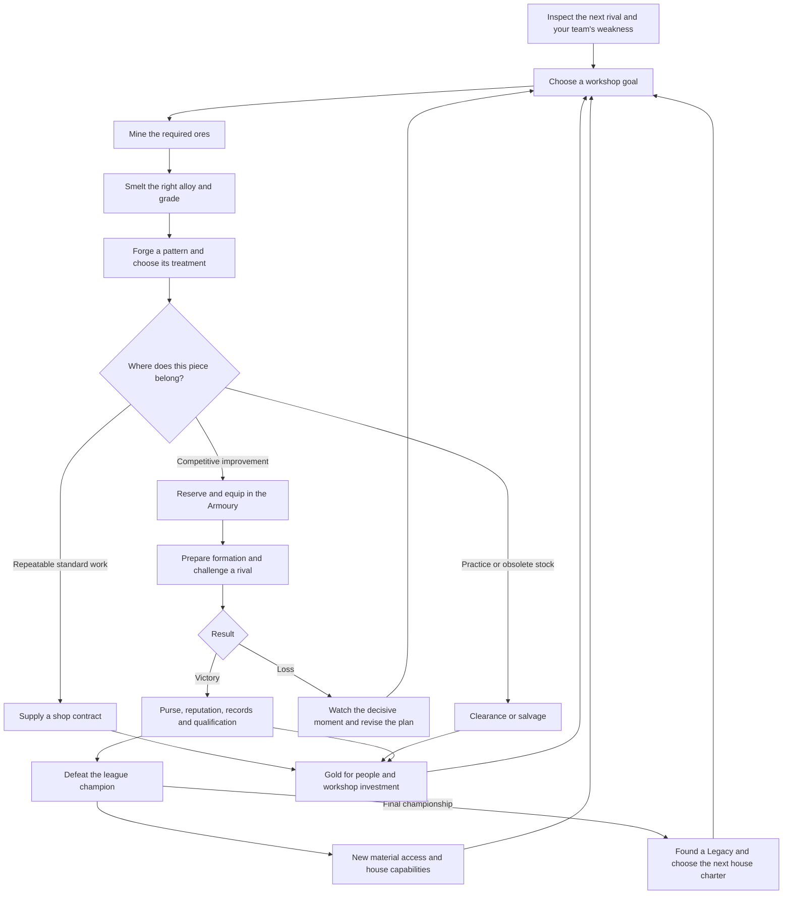
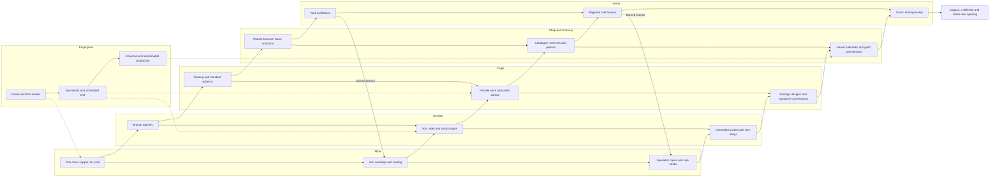
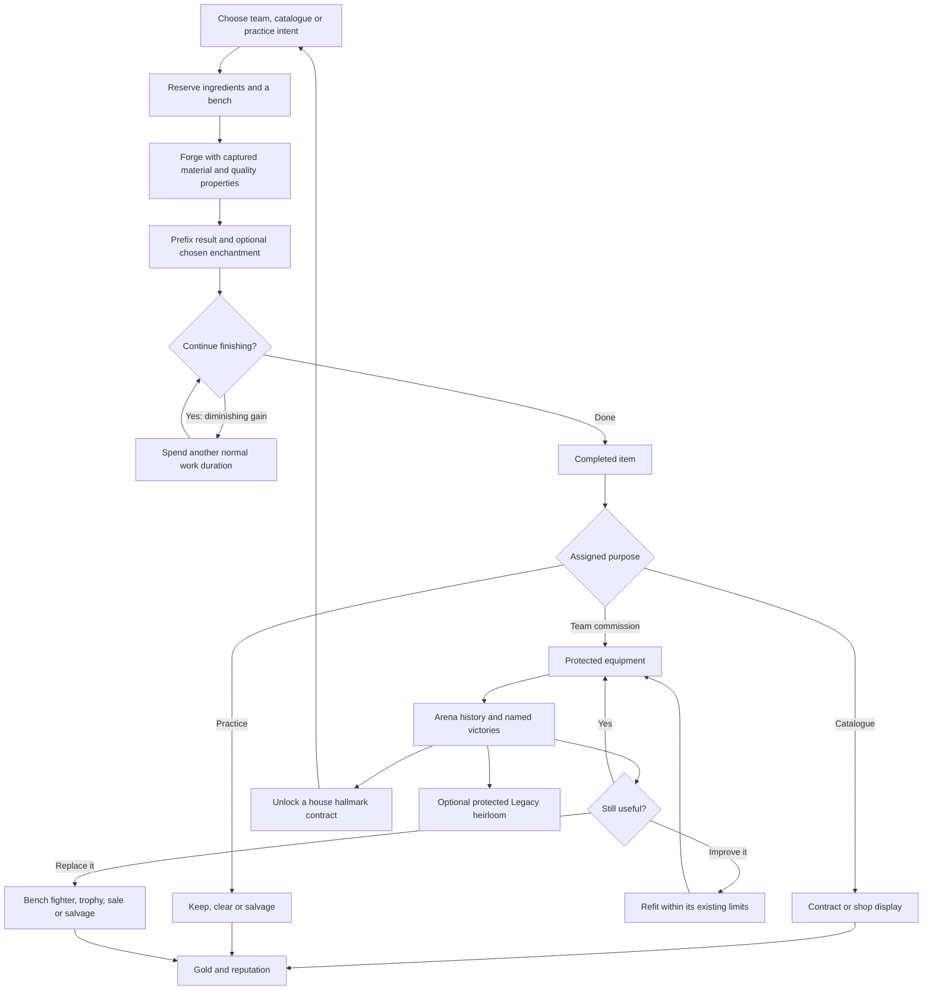
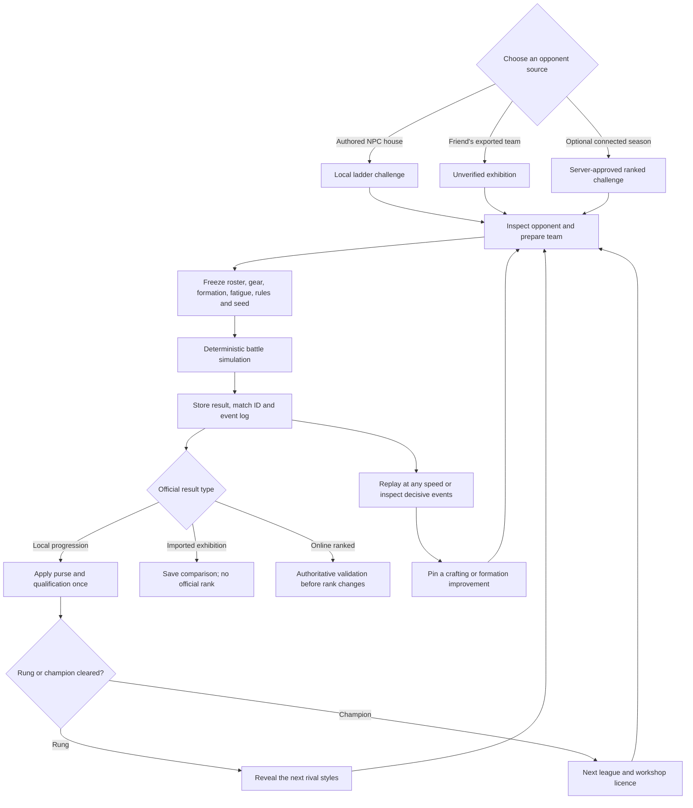
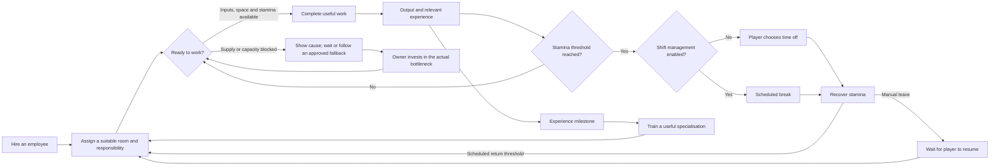

# Ember & Iron: The House of the Hammer

## The original whole-game proposal

**House edition 3.0 update:** the local arena-house loop is now playable. Read the [implementation guide](house-guide.html) for shipped features, measured playtest results and remaining extensions. The proposal below is retained as design history; individual aspirational examples are not a release checklist.

**Your weapons enter the arena. Your workshop wins the crown.**

The player begins as an obscure smith with a leaking workshop and three fighters wearing borrowed equipment. They build a smithing house: a mine, a foundry, a staff of craftspeople, a recognisable catalogue, and a gladiator team that proves their work in public. A great shield is no longer an anonymous sale. It is the shield that kept Mara standing against the Iron Choir—and the crowd remembers it.

This proposal replaces the game's centre of gravity, not just its quest screen. The main growth loop becomes **identify a competitive weakness → improve the production chain → make the answer → equip the team → prove the design → reinvest the winnings**. A dependable shop supports that loop, and repeat work becomes an earned source of idle income.

**Original proposal status:** This was written before the House edition implementation. The local league, owned team, contracts, item intentions, staff room, deterministic replays, charters and redesigned interface now ship. Online/friend-team exchange, procedural audience commentary and deeper workshop logistics remain future extensions.

The recent review supports this direction: five- and fifteen-minute visits can already sustain a prepared workshop, but a single production pattern eventually exhausts its buyers. The redesign gives the player a stronger reason to make the next item and separates reliable workshop income from competitive equipment decisions.

## 1. Choose a clear identity

The strongest fantasy is **a blacksmith whose craftsmanship creates champions**. The player should spend more attention on metal, equipment and production than on issuing combat commands.

| Direction | What it offers | Main weakness | Recommendation |
|---|---|---|---|
| Keep autonomous questing customers as the central loop | Familiar shop fantasy; little team management | Indirect agency, unclear demand, progress depends on NPC purchasing choices | Retain its best presentation and visitor behaviour, replace its progression role |
| Make a pure factory and contract game | Clear demand, excellent idle production | Weapons become interchangeable commodities; the RPG loses its purpose | Use this as the workshop's financial foundation |
| Make a gladiator house with contracts and an authored rival ladder | A visible reason for each item, meaningful losses, team attachment and watchable results | Could become a combat manager that sidelines smithing | **Recommended**, with automatic battles and crafting as the primary solution |
| Make competitive online PvP the main gate | Rivalry, sharing and a long tail | Requires services, fair matchmaking and authoritative validation; pressures players to optimise constantly | Optional later exhibition layer; never required for main progression |

The shop and the arena serve different purposes. **Contracts pay for the workshop. The team proves what the workshop can achieve.** A sale should not be required before the player is allowed to equip their own fighter.

## 2. The room map

Use eight clear destinations. Replace **Customers** with **Arena**, expand **Shop** into **Shop & Armoury**, and keep employee management in its own room.

| Room | Main question | Core interaction | Upgrade sections |
|---|---|---|---|
| **Smith — player name** | What kind of maker am I becoming? | Attributes, profession, class mastery, research goals and house identity | Disciplines, specialisations, workshop knowledge |
| **Mine** | Which supply shortage should I solve? | Assign crews, select workings, set material targets and inspect rich pockets | Depth, crews, transport/storage |
| **Smelter** | What properties should this metal have? | Alloy recipes, treatment, input reserves and stock targets | Alloys, control/quality, throughput |
| **Forge** | What am I making, and for whom? | Pattern, material, prefix treatment, enchantment and finishing | Patterns, craftsmanship, production |
| **Shop & Armoury** | What should the house keep, sell or reproduce? | Team equipment, protected stock, contracts, displays and clearance | Contracts/prices, stock handling, patrons |
| **Arena** | What will beat the next rival? | Team, formation, ladder, challenges, results and replays | Fighter licences, preparation, exhibition management |
| **Employees** | Where will the next person make the biggest difference? | Recruitment, assignment, training, rest and production responsibilities | Housing, training, management |
| **Legacy** | What should the next generation inherit? | Retirement charter, permanent talents, heirloom and house history | Workforce, efficiency, metallurgy, archives |

Desktop can show all eight rooms. On phones, group them into **Workshop**, **Arena**, **People**, and **Legacy**, remembering the last room within each group. The player portrait opens Smith; People opens Employees. This is navigation grouping, not hidden progression.

Every room shows four things before its decorative details: **what is running, what is blocking it, what the player can do now, and the next meaningful unlock**. Keep the full-screen scene as atmosphere. Use a small persistent battle viewer while the player works elsewhere, with a clear return-to-replay button after the bout ends.

## 3. Rebuild the production side around decisions

### Mine: become an extraction operation

Begin with exposed copper, tin and coal, one worker and a handcart. Keep finite bins and visible assignments. Additions should change what can be supplied, rather than merely apply another invisible percentage.

- **Surveying** reveals the next working, its expected output, access requirements and associated alloy. The next vein always explains the production opportunity it opens.
- **Crews** are assigned to targets: keep coal at twelve, then help copper; keep enough iron for the planned team set. A more skilled miner reduces interruptions or handles a difficult seam; they do not randomly create equipment.
- **Rich pockets** are optional bursts with known contents. Players can redirect a crew for a while, sacrificing routine output to recover useful material. Normal seams never deplete permanently, so ignoring a pocket cannot break the economy.
- **Active mining** becomes a short work order such as “help load the next cart” or “survey this pocket.” Remove the requirement to click every seven seconds throughout the opening. Active involvement might bring forward the next shipment; it should not supply ten times the idle crew indefinitely.
- **Transport and storage** expose the actual bottleneck. A second miner is useful when ore supply is short; a larger cart is useful when workers wait for hauling. Do not introduce both constraints before the player has understood the first.

Full bins still discard excess from a player-authorised delivery, with the loss previewed. Managed production should wait or redirect before generating avoidable overflow. No hidden mailbox becomes infinite storage.

Material access comes from workshop development plus earned league licences. A champion must always be defeatable with the previous unlocked tier: never require the ore awarded by that champion to beat them.

### Smelter: materials become part of a build

Preserve the recognisable ladder of bronze, iron, steel, mithril and starforged metal, then make the choice within a tier interesting.

Start with reliable bronze. Introduce only one new dimension at a time:

1. **Early:** alloy ratios and supply reserves. The player learns why copper alone is insufficient.
2. **Middle:** a small number of named grades or treatments. Tough steel favours armour and stagger resistance; spring steel favours light weapons and bows. Standard steel remains broadly useful.
3. **Late:** unusual combinations for specific builds—light mithril with lower stagger resistance, or starforged metal that accepts a powerful enchantment but needs expensive preparation.

Avoid a spreadsheet of twenty invisible ore properties. Give a material two clear advantages and one understandable cost. An assay upgrade reveals exact output and unlocks controlled preparation. Do not let buying it retroactively improve every old ingot or finished weapon.

Stockkeeper rules maintain selected outputs and recursively request intermediate alloys. A player might reserve eight iron ingots for armour while allowing surplus iron to become steel. Priority and resource reservation are more interesting later upgrades than endlessly adding furnace speed.

### Forge: each important craft has an intention

Use three explicit work modes:

| Mode | Intended result | Automation behaviour |
|---|---|---|
| **Team commission** | A specific fighter improvement or opponent counter | Reserved output; show the equipment comparison; never auto-sell |
| **Catalogue order** | Known profitable work for a contract | Maintain the requested quality band and quantity |
| **Mastery practice** | Learn a class or approach a difficult design | Show XP, net supply cost and expected clearance return before starting |

Keep recipe → material → enchantment, but add an optional **crafting treatment** when a relevant station unlocks. Ordinary forging can still roll a prefix; a selected treatment weights the prefix family or raises its floor. The player gradually gains control over luck. Enchanting supplies a chosen suffix with known cost and effect.

Retain training, standard and prestige patterns. Training is efficient practice and cheap commercial work; standard equipment is the dependable competitive baseline; prestige designs are expensive specialisation rewards that can rival the next material tier. This preserves the decision between learning something new and mastering an established class.

Keep diminishing finishing: **+20, +10, +5, +2, +1 quality**, each pass costing a normal craft's worth of time. Display the actual benefit after the quality cap and the revised completion time. A future refitting station can finish an owned piece without requiring an identical new item, while respecting its existing pass count.

Remove redundant gates where possible. A pattern should have an intelligible licence, relevant mastery and a capability requirement. It should not repeatedly demand an arbitrary smith level, unrelated stat, unrelated station and separate currency purchase for the same advance.

### What a meaningful upgrade does next

| Purchase or achievement | Immediate change | New decision it creates |
|---|---|---|
| Second miner | Coal and copper can be supplied together | Prioritise faster bronze or save for storage |
| Iron licence and crucible | Iron recipes become feasible | Re-equip the tank first or improve a damage dealer |
| Assay bench | Choose a material treatment with predictable output | Toughness versus speed, and the cost of a special batch |
| Second forge bench | Practice can run beside a team commission | Split work between cash, mastery and competition |
| Controlled prefix tools | Bias a useful affix family | Pay for consistency or accept a cheaper random roll |
| Quartermaster | Reserve a complete team set across rooms | Spend spare output on contracts without stealing team inputs |
| Contract clerk | Maintain a small catalogue automatically | Which mastered designs should finance the next experiment? |
| New fighter licence | A named specialist joins the house | Which existing fighter should rest, and which item classes become valuable? |
| Rival scouting room | Reveal a formation and its signature tactic | Build a counter instead of adding raw item score |
| First Legacy charter | Start with a recognisable operational advantage | Expand a familiar production style or try a new one |

## 4. Shop & Armoury: keep the blacksmith business

Replace the current dependence on named adventurers buying upgrades with three dependable outlets, all visible in the same room.

**The team armoury** owns competitive equipment. Drag a piece onto a compatible slot, or press Equip from a comparison. Show the replaced item and resulting damage, protection, speed and loadout conflicts. Team gear is automatically protected. Equipping is free; the house already paid to make the item.

**The contract counter** provides baseline cash. A local guard order might request three standard daggers of at least Q35. It has a disclosed payout and delivery quantity; the order remains until filled or deliberately replaced. Better reputation unlocks larger or more demanding clients. Routine orders replenish through game progress or completed work, without real-world daily deadlines.

**The display shop** sells catalogue work and occasional premium commissions. Ordinary townspeople can browse, admire championship pieces and purchase suitable goods. They are flavour and upside, not a hidden failure point in the main loop. Lowest-quality eligible stock still fills displays first. Team reservations, protected pieces and named commissions take precedence over all clearance rules.

Do not make an elite, six-hour weapon economically equivalent to ten disposable daggers. A competitive success can establish a **house hallmark** for its design: a named catalogue line that attracts a better contract. The original item remains a keepsake; a profitable family of related work pays back the experiment.

An example: Mara wins the Gatehouse Final carrying the player's first reinforced buckler. A patron commissions six “Gatehouse-pattern” bucklers. The team keeps the original, the Forge gains a concrete production goal, and the shop turns a remembered fight into dependable income.

### Item lifecycle

Weapons should mostly enter the world through the player's forge. Arena prizes award plans, materials, licences and money rather than constantly dropping superior finished equipment that bypasses crafting.

- A piece may be equipped, reserved for a planned loadout, sold, displayed as a trophy, refitted or salvaged.
- Replaced equipment can go to a reserve fighter, become a contract example or fund the next design.
- Salvage returns a bounded fraction of inputs. Salvage and refunds award no crafting XP or extraction progress; a circular craft/salvage chain must consume something.
- Combat history gives an item identity and cosmetic prestige, not an unlimited hidden damage multiplier.
- A protected heirloom may cross Legacy. Its history stays intact; inherited power follows the declared Legacy rules.

## 5. Smith identity, mastery and build choices

Keep **zero starting attributes and twenty assignable points**, plus five points per smith level. Keep uncapped attributes with diminishing continuous benefits. Show what the next point changes, the next visible breakpoint and any pattern it would unlock.

| Attribute | Primary identity | Important effects |
|---|---|---|
| Strength | Working heavy material efficiently | Craft speed, heavy-piece quality, carrying/handling thresholds |
| Precision | Consistent craftsmanship | Base quality, useful prefix chance, tolerance for demanding treatments |
| Knowledge | Understanding materials and designs | Class mastery gain, alloy and enchantment understanding, diagnostic research |
| Charisma | Building a sustainable house | Contract margins, patron opportunities, recruitment terms and shop reputation |

Charisma should not become obsolete when the team stops buying its own equipment. Move its budget effects toward contract terms and commercial throughput. Avoid a direct Charisma-to-combat multiplier; the point is that a merchant smith can finance equipment sooner while an armourer makes an individual piece more efficiently.

Professions should change the first meaningful decision, not just provide several small percentages:

- **Bladesmith:** reliable early weapon prefixes and efficient offensive commissions.
- **Armourer:** better heavy protection and a cheaper route to a complete defensive set.
- **Artificer:** earlier access to one modest enchantment; stronger material experimentation later.
- **Prospector:** a more capable first crew and a revealing survey advantage.
- **Guild factor:** an initial commercial relationship and a stronger contract margin.

Every profession must be able to build a competitive three-person team. The first one should feel different, not trap the player into an unavailable class.

Keep class mastery as the large, prominent number. At selected mastery milestones, unlock a genuine capability: lower material waste, a controlled treatment, a standard production method, or a prestige pattern. Do not add a second full XP grind for every individual recipe at launch. Recipe history and hallmarks can provide attachment without another hundred progress bars.

The central mastery choice is explicit: **make today's counter, or practice a familiar class to unlock tomorrow's material tier**. The Forge should show the expected time and economic cost of both options.

## 6. The gladiator house

Start with the existing named trio—Mara, Renn and Wren—reframed as the house's first team. Their identities and classes are authored. The player equips and deploys them; a hero-naming form is unnecessary.

Use **three active fighters**, with a growing bench. Three gives each equipment change enough importance and keeps the battle readable on a phone. Unlock new licences and named specialists through achievements. A new class should arrive with a reason to use it, an introductory opponent or request, and access to its training patterns.

Keep front and back lines. The front must break before ordinary attacks reach the rear. Any exception must be an explicit, telegraphed ability with a cost, not an unexplained bypass.

The player's pre-battle decisions are deliberately limited:

1. Which three fighters and which front/back formation?
2. Which equipment and enchantments?
3. Which unlocked doctrine—hold formation, aggressive advance, or protect the rear?

Battles run automatically. No reflex attack button should determine whether an otherwise prepared idle player wins. Watching teaches; it does not replace planning.

Fighters gain experience, modest base stats and role techniques. Most competitive power should remain visibly attributable to equipment. A sensible starting tuning budget is roughly 60–70% of the difference between a novice and a developed team coming from gear, with the rest from experience, formation and support. This is a balance hypothesis to test, not a claim about the current formulas.

### Three kinds of competition

**Exhibitions** are reliable repeat work against cleared opposition. They pay a modest purse, provide experience and keep the arena alive while the player is away. An automation policy can choose the toughest cleared opponent above a stated confidence threshold, subject to rest and time limits.

**Rival-house challenges** are the main ladder. Each rival has a recognisable smithing philosophy. Their gear should make the counter legible:

- **The Iron Choir:** a shield wall around one dangerous backliner. Test armour penetration and sustained protection.
- **The Red Thread:** fast blades that punish an exposed rear. Test formation, stamina and crowd control.
- **The Glass Lantern:** fragile enchanted weapons behind a warding front. Test elemental protection and breaking the right defender.
- **The Ashen Bell:** heavy equipment that wins long fights. Test speed, evasion or a decisive early break.

**Special commissions and cups** add optional constraints: bronze-only, no enchantments, a single champion, unfamiliar arena footing, or a patron-requested weapon family. They award sidegrades, hallmarks and cosmetic trophies rather than become mandatory daily chores.

### League progression

Preserve the clarity of the current five-win structure. Each of five leagues has three qualification rungs and a champion. A rung requires **five scoring wins, including a win against each of three rival styles**. This maintains accumulation while discouraging five repeats of the weakest opponent as the only solution.

An exhibition against an already cleared rung pays its recurring purse but does not invent new qualification. A champion unlocks the next league, a workshop capability and a memorable house milestone. Launch champions deliberately; routine exhibitions may be automated.

One defeat never removes earned qualification or permanently destroys a prized item. There should be stakes—lost time, recovery and a missed purse—without turning experimentation into a punishment.

### Losses should tell the player what to make

The result screen highlights one or two decisive moments: “Mara's front line broke with the archer still at 62% health,” or “Seven blocked blows accounted for most of the lost damage.” Offer a clear mechanical explanation, not a vague instruction to increase power.

The player can pin a response: improve Mara's protection, switch the striker's weapon, prepare a ward, or change formation. An optional sandbox uses the frozen opponent to compare owned loadouts without rewards. It must distinguish a simulated comparison from the official match.

Recovery can be shortened with facilities and scheduled by a healer. A reserve fighter permits continued exhibitions at reduced strength. Do not reward endless losses with unlimited unlock currency. First-time lessons can reveal information or provide a bounded tutorial safety net; they should not replace victories and a functioning forge.

## 7. Other smiths, ladders and deterministic replays

The complete main game should run locally. Rival houses are authored NPC smiths, explicitly labelled as such. They have workshops, signature equipment, repeatable personalities and a place on the local ladder. A “rival smith” does not imply another real player.

Later, permit **imported house exhibitions**: a friend exports a team snapshot and the player fights it locally. Label it imported and unverified. These battles offer comparison and a shareable replay, not mandatory resources or trusted competitive rank.

An optional online season can eventually use submitted team snapshots, divisions and asynchronous challenges. Its official results need authoritative validation; a freely editable local HTML save cannot by itself establish a fair global leaderboard. No server, account or live opponent should be necessary to finish the main game. Ranked online matches do not run while offline, and nothing is uploaded automatically merely because a player watched a local replay.

### Replay contract

At launch, freeze the teams, equipment, resolved stats, fatigue, formation, doctrines, arena rules, combat version and random seed. Use a deterministic combat simulator independent of the renderer. Viewing at a different speed, changing rooms or reopening a save cannot change the outcome.

A replay includes the frozen snapshot and a compact event log. It can show normal speed, fast playback, round steps, health/armour history and the decisive event. New upgrades affect future matches only. Older replays retain their original rules or use the stored event log with a clear version label.

Each official local challenge has a persisted match ID. Rewards can be claimed once. Replaying never rerolls or repays the match. Fixed rival challenges keep their issued seed across retries until their declared challenge changes; reloading is not a substitute for improving the build. A later best-of-three championship can use a fixed three-seed set to reduce a single lucky critical hit deciding promotion.

## 8. Employees become the machinery of an idle house

The dedicated Employees room is the correct place for hiring, assignments, experience, stamina and time off. Individual rooms should still show their assigned people and the practical consequence of a missing role.

**Current implementation:** Mine has a foreman and quartermaster; Smelter has a tender and assayer; Forge has an apprentice and runekeeper; Shop has an envoy and shopkeeper. Its twelve upgrades cover Training, Welfare and Organization. Existing miners remain the reliable baseline crew. Keep this implementation as the foundation; the roles below describe proposed capabilities and are not an extra roster to add wholesale.

Use employees to unlock delegated decisions as well as increase throughput:

| Work area | Early role | Later specialist | Capability unlocked |
|---|---|---|---|
| Mine | Miner | Surveyor / foreman | Multiple supply assignments; then target-aware crew routing |
| Smelter | Furnace hand | Metallurgist | Reliable repeat batches; then controlled grades and alloy priorities |
| Forge | Apprentice | Journeyman / engraver | Practice beside the smith; then catalogue production and controlled finishing |
| Shop & Armoury | Clerk | Quartermaster | Contract fulfilment; then team reservations and safe clearance |
| Arena support | Attendant | Trainer / healer | Managed recovery and exhibition scheduling; modest role development |

The first hire should visibly free the player from a repetitive task. The second should let two needs coexist. A foreman should coordinate a known policy, not create resources from nowhere.

Keep staff experience, stamina and rest. Make the rested-versus-exhausted effect visible before assignment. An employee learns from relevant work, with a cap on repeated trivial training. Facilities improve the rate or quality of their work; training unlocks responsibilities. These are different purchases.

Retain manual time off and a later shift-management option. Scheduled rest reduces average production but makes it dependable. Do not make the player wake up at night to avoid ruined resources or unpaid wages. Recruitment, training and facilities provide enough early monetary pressure; recurring wages are unnecessary in the first implementation.

Mine crew stamina, specialisations and cross-room assignment rules are **future extensions** of the Employees work, not assumptions that every present worker already has those systems. Keep the initial implementation small enough to make every assignment understandable.

## 9. Economy and upgrade structure

Be bolder about removing clutter: use **gold and physical materials** for ordinary spending, with **Legacy sparks** as the later permanent currency. Make Prospecting, mastery, reputation and qualification earned progress records rather than four additional purses to monitor.

Mining milestones prove the house can operate at depth. Smelting milestones prove an alloy has been made reliably. Successful crafts prove mastery. Contracts build reputation. Arena results grant licences. Purchases still require their relevant achievement, but the cash investment is understandable across the whole workshop.

This makes “hire a worker, open iron, or build the team's next weapon?” a real shared-budget decision. Retain room-specific upgrade sections and deliberate prerequisites; remove unrelated prerequisite taxes and duplicate upgrades that offer the same small bonus under different names.

### Sources and sinks

| Resource or record | Main source | Purpose or sink |
|---|---|---|
| Gold | Disclosed contracts, catalogue sales, exhibition purses and first-clear rewards | Employees, facilities, wood/leather/oil, treatments, enchantments and optional respecialisation |
| Ore and coal | Mining crews, surveys and occasional clear rewards | Ingots and alloys |
| Ingots and purchased supplies | Smelting and procurement | Crafting, refitting and selected workshop investments |
| Reputation | Fulfilled contracts and public arena achievements | Permanent access to better clients and opportunities; not spent down |
| Qualification | Scoring wins at the current rung | Unlock its challenge; no farming it into unrelated purchases |
| Legacy sparks | A completed championship and bounded additional accomplishments | Permanent capabilities and inheritance choices |

Contract payments must cover disclosed consumable costs with a useful margin. A weak team must not bankrupt the only route to making better equipment. Basic practice and early exhibitions need a recoverable floor: normal ore remains obtainable, a basic contract can always be completed, and failed matches do not charge a compounding debt.

First-clear rewards should feel substantial. Repeat exhibitions pay a smaller, stable amount so an easy old opponent can sustain the house without becoming the fastest route to every future unlock. Exact percentages need simulation; a prototype can start repeat rewards at roughly a quarter of the comparable first-clear purse.

Keep exponential rank costs, but tune **payback time** as well as price. Early investments should create a visible capability or repay themselves over a manageable session; later upgrades can require several sessions. A larger number is not a reward unless the player's next decision changes.

## 10. Pacing, sessions and the opening

These are **proposed tuning targets**, not measured predictions. Current v2.2's informed simulations reached the first boss around an hour, but this new economy and battle structure must be tested independently.

| Stage | Intended cadence | What should feel different |
|---|---|---|
| First 10 minutes | A concrete action or visible completion every minute or two | Forge an identifiable item, equip it, watch it affect a safe bout |
| 10–45 minutes | Several modest goals and a first delegation purchase | Complete a basic team, establish a profitable contract, automate one bottleneck |
| 45–120 minutes | First meaningful rival final or league promotion | Win by a visible equipment or formation decision; open a new production capability |
| Middle game | Five- to fifteen-minute visits remain useful; larger goals span sessions | Multiple material plans, a reserve fighter, catalogue income and chosen counters |
| Late game | Prepared production and exhibitions run for one to eight hours | Rare team projects, deliberate championship attempts and Legacy planning |
| Later generations | The old opening compresses visibly | Inherited systems permit a different strategy rather than a longer repeat of the same tutorial |

### A concrete opening sequence

1. Create the smith and allocate twenty points. Show a sensible suggested distribution without making the decision irreversible before the first craft.
2. Meet the three named fighters and see the house's shabby practice yard. One obvious need is pinned: Mara's borrowed shield fails to hold the front.
3. Mine and smelt the first bronze with a small deterministic supply plan. Explain copper, tin and coal through the task rather than a long resource lecture.
4. Forge a buckler or first weapon; equip it with an immediate comparison. The player can see precisely who received their work.
5. Run a short, safe demonstration bout. Its purpose is to reveal the effect of the equipment, not test whether a novice found the optimal build.
6. Deliver a basic guard contract for the first investment. The player chooses a second worker, a production improvement, or another team piece.
7. Reveal the first rival and its signature tactic. The player now has a reason to diversify equipment and learn a class.
8. Earn bounded automation and choose the next target. End the guided opening with a functioning workshop that can be left alone for a while.

Offline time uses the same production and combat rules as online time. It runs only already-authorised policies, with the player's resource reserves, queue and capacity limits. It never chooses a new rare recipe, sells protected gear, selects a Legacy or launches an unapproved champion.

The return summary leads with accomplishments and blockers: “Six contract pieces sold; two fighters recovered; iron is short; the promotion challenge is ready.” Do not present an empty forge as mysterious failure when its target has simply been satisfied.

## 11. Legacy should change the next run

The first full championship unlocks retirement. The smith retires into the house's history, leaving trophies, a catalogue reputation, an heirloom and an enduring method. The player chooses a new charter for the next generation.

Keep the existing Workforce, Efficiency, Metallurgy and Archives themes, but favour capabilities over a wall of small stat increases:

- **Established workshop:** start with a second crew and a basic production policy.
- **House method:** keep a mastered standard production technique from the previous generation.
- **Foundry tradition:** extra ingot yield, a known alloy treatment or reduced rank-cost growth.
- **Patron endowment:** begin with a known contract client and a modest reserve.
- **Archive:** inherited rare and legendary patterns that still require appropriate materials and mastery.
- **Champion's legacy:** preserve the story of one item and a bounded starting advantage for its wielder.

Do not reset decorations, item history, discovered explanations or tutorial knowledge. Do reset the campaign economy, league qualification and the temporary workshop build. A small number of meaningful inheritance choices should make generation two feel recognisably different by its first ten minutes.

Do not set a precise first-retirement duration until the first two leagues and the full material ladder have been simulated. The goal is a satisfying completed career followed by a transformed opening, not an arbitrary number of hours or a requirement to repeat the entire game eighteen times.

## 12. Transition and implementation order

### Preserve the current player's investment

This is too large to apply as a silent destructive save conversion. Keep an exportable **Classic workshop** save and offer a separate **Arena house** slot when the new loop is ready. Preview the conversion before accepting it.

Carry over the smith identity, authored character names, crafted items and their properties, staff investments, furnishings, mastery records and Legacy ownership. Preserve previous quest history as an archived chapter. Existing customers can become the first house roster, with equipment retained.

Translate old room currencies and obsolete upgrades through an explicit credit table. Credit equivalent capabilities or refundable house-development value; do not erase paid ranks, award duplicate rewards, or pretend old PvE achievements were online ladder wins. Old late-game saves may begin in a declared advanced local league after a calibration challenge; imported progress cannot establish official online rank.

### Build a vertical slice before adding the entire ladder

| Phase | Implement | Evidence required before expanding |
|---|---|---|
| **0 — current foundation** | Validate the dedicated Employees update and keep the current game stable | Saves, assignments, stamina and existing production still work |
| **1 — prove the new loop** | Free team equipment, one contract counter, three rival teams, one champion and saved local replays | A player can identify a weakness, forge an answer, equip it and see why the rematch changed |
| **2 — prove idle viability** | Bounded catalogue production, team reserves, stock targets and safe repeat exhibitions | Active, five-minute, fifteen-minute and unattended runs all progress without secret resource starvation |
| **3 — deepen materials and mastery** | One alternate steel treatment, one controlled prefix family, explicit practice mode and useful staff specialisations | At least two viable builds beat the same champion without simply raising every stat |
| **4 — grow the house** | Full local leagues, reserve roster, patron contracts, hallmarks and Legacy | Full-campaign and second-generation tests show rewarding milestones and a faster inherited opening |
| **5 — optional rivalry** | Imported teams, shared replay files, then separately assessed online seasons | Replay compatibility, honest opponent labels and authoritative ranked validation are solved |

Do not start with a hundred opponents or a networked leaderboard. Start with one memorable loss, one purposeful craft, and one rematch where the player can point to their own work and say: **that is why we won**.

### First acceptance tests for the redesign

- A player can always recover economically from several early losses without resetting.
- Two different equipment approaches can beat the first champion.
- A competent five-minute check-in policy remains within roughly 70–90% of active routine production, while active decisions can reach discoveries sooner; this is an initial tuning hypothesis.
- Three random seeds do not produce dramatically different access to essential automation.
- One hour unattended completes meaningful authorised work and reports the first actual blocker.
- Replay results match the original match online, offline, after reload and at every playback speed.
- Replaying, importing or retrying cannot duplicate rewards or reroll an already issued official challenge.
- Champion progression cannot require the material awarded by that same champion.
- All major upgrades change a visible capability, a measurable bottleneck, or a real decision.
- The first Legacy makes a new opening noticeably different without invalidating every earlier item class.

The proposed destination is a game about **craftsmanship made visible**: a working mine behind every alloy, an employee behind every reliable production line, a reason behind every weapon, and a remembered fight behind the finest pieces in the hall.
