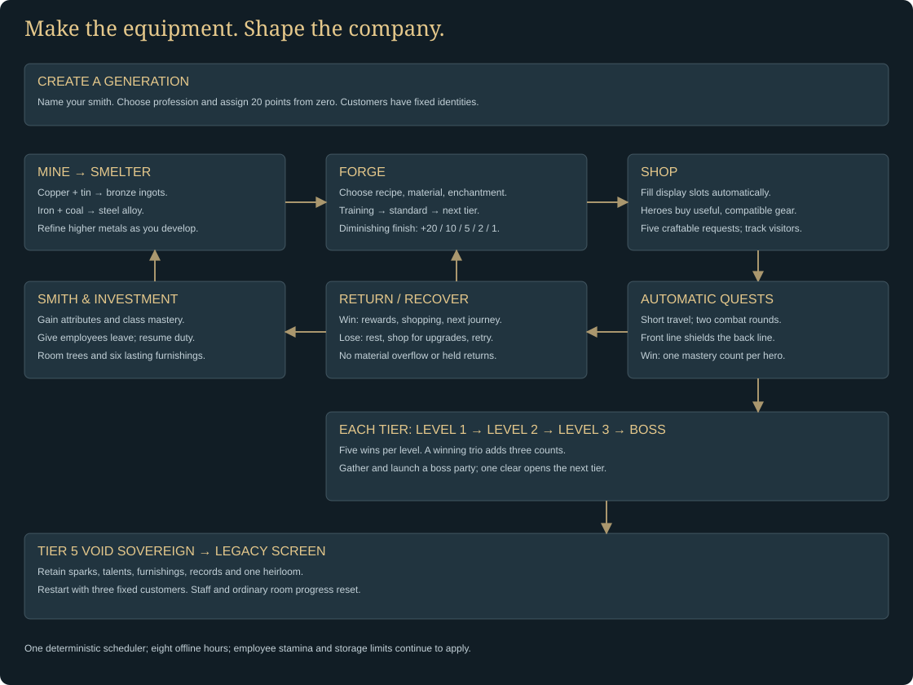
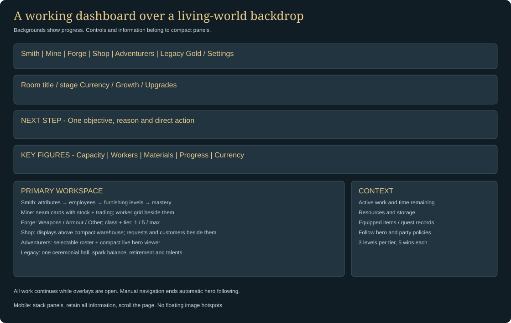
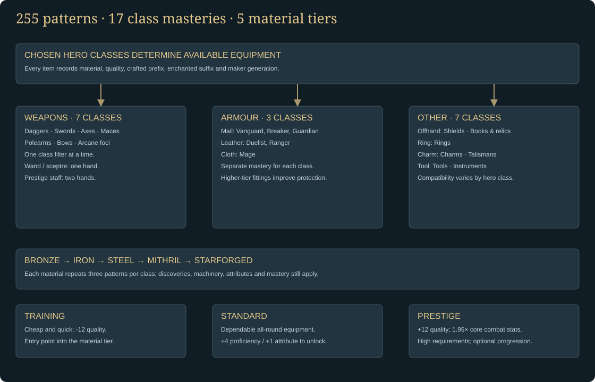
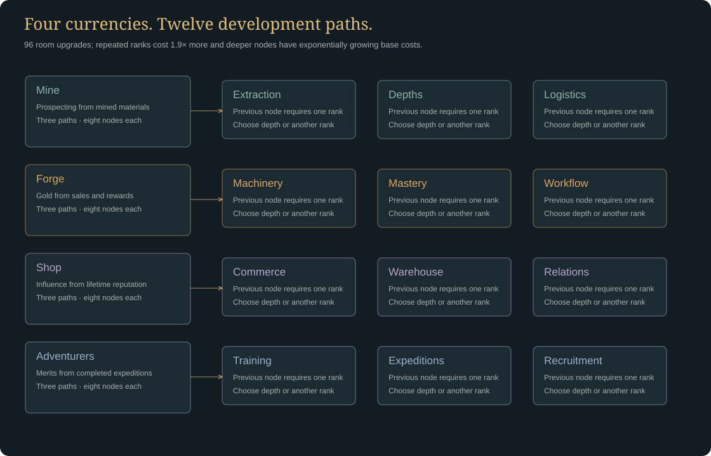
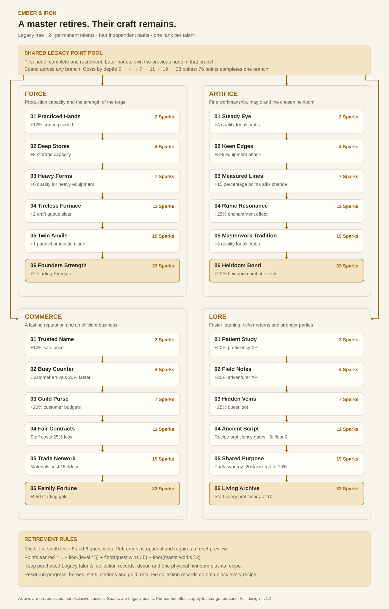

# Ember & Iron — The Foundry

Version 2.2.0 · playable design specification · 4 October 2026

## The game we are building

A slow incremental blacksmith RPG about making the equipment that changes other people’s stories. The player is the maker: mine materials, choose what to craft, improve familiar item classes, fill the displays and invest in the workshop. Adventurers manage their own shopping, quests, parties, retreats and returns. Ordinary quests are automatic. At each tier, the player chooses and launches a boss party as a deliberate equipment checkpoint.

The visual direction is original cinematic fantasy. Each room has a humble, established and grand background, progressing independently as the workshop develops. Art sits behind the interface and has no floating buttons. On room changes, the background fades from 8% to 42% opacity over 0.6 seconds, beneath a fixed dark gradient. It never reaches full brightness; interface panels stay fully opaque. Reduced motion keeps the dim resting appearance without animation. Compact dark panels, brass accents, one objective strip and a row of key figures lead into the current room’s work. Information occupies the screen instead of reserving empty space for an illustration.

This document describes the implemented game. Long-term balance remains a tuning task; exponential costs are intentional, but full late-game progression has not been validated through a multi-day human playthrough.

## Game flow

The opening state is intentionally modest: 12 gold; 6 copper ore, 3 tin ore, 4 wood, 4 leather and 6 coal; one miner; a basic anvil; one active crafting bench; five waiting queue slots; six display slots; and three heroes. A balanced 5/5/5/5 Bladesmith smelts the first three bronze ingots in 24 seconds, then creates a training sword in about 49 seconds. Smelting and forging run concurrently. Training gear has a deliberately small customer margin; standard patterns improve value and combat strength. Mining and practice matter because buying every ingredient leaves a small margin.

The first next-objective prompt directs the smith to make a training weapon that the starting customers can use. While it is working, the objective suggests a careful finish. Afterward the player can broaden a hero’s loadout with armour and shields, or repeat a weapon class to improve proficiency. Heroes initially wear poor equipment and often retreat. They retain their identity, equipment and memories, recover, browse for improvements, and choose a retry or an easier reachable quest.

A finished item fills an available display slot automatically. If all display slots are full, it enters the warehouse. Empty displays always refill automatically from the lowest-quality eligible warehouse stock; porter service adds capacity. Displayed, unprotected, unreserved items may be purchased. A hero checks compatibility, affordability and actual improvement before buying.

## Seven rooms and information hierarchy

| Room | Background progression | Main work | Deeper overlays |
|---|---|---|---|
| Smith | Rented attic study to comfortable study to master’s estate | Attributes, employees with stamina/XP, furnishings with permanent levels directly below employees, then prominent class mastery levels | Character bonuses and collection |
| Mine | Shallow timber shaft to established iron mine to deep galleries | Seam cards with stock, manual mining and trading; adjacent worker assignments; mining-point progress | Mining development and room growth requirements |
| Smelter | Clay hearth to alloy workshop to celestial smeltery; forge-stage artwork with an animated furnace | Smelt 1, 5 or max batches; ore/alloy recipes; ingot bins and an independent queue | Alloys, Quality and Speed upgrades |
| Forge | Lean-to anvil to working village smithy to grand foundry | Weapons / Armour / Other, then class, recipe, material and enchantment; craft 1, 5 or maximum | Active queue, careful finishes, machinery development, late production rules |
| Shop | Bare shelves to village outfitter to guild emporium | Display shelves followed by a compact warehouse list; craftable requests and browsing customers beside them | Item inspection, protection, enchantments and shop development, including unlocked salvage settings |
| Customers | Roadside inn to company lodge to guild hall | Selectable roster, live hero viewer, phase timer, compact final stats, equipped items and recent quests | Actual battle replay, hero loadouts, quest records, party policies, recruitment and training |
| Legacy | One ceremonial hall, unchanged across generations | Sparks, retirement preview, inherited records and four talent paths | Unlocks after the first tier 5 boss victory |

The global header contains seven room tabs, gold and settings. The room toolbar pairs its name and stage with the primary progression control: a large spendable currency balance and a prominent gold upgrades button. A live ready-to-buy count uses the same affordability and prerequisite checks as the upgrade tree. When no purchase is available, the control explains how to earn its currency; completed trees show that all upgrades are fully developed. Smith instead displays an unspent attribute-point balance without an Improve smith button; allocation remains directly beside each attribute. Room growth remains a secondary control. The Legacy tab is greyed out with an accessible lock explanation until the first tier 5 boss victory. On phones the progression control fills the available width. A horizontal objective strip explains the next useful action. Key figures precede a two-column workspace: primary controls at left, work queues, stock or context at right. The Customers workspace pairs a compact roster with a selected hero viewer. Upgrade overlays put three section selectors at the top and show only the chosen branch, with ranks, costs, prerequisites and effects.

Wide screens use the available workspace up to a comfortable 1,840px content width. Mine pairs a responsive two/three-column seam grid with worker assignment cards; large crews scroll within the worker panel on desktop. Stock and trade controls stay on each seam, without a duplicate mined-material sidebar. Leather, wood and Alchemical Oil share one compact Crafting supplies panel in the right-hand section of both Mine and Forge, above worker assignments or work in progress. Their amounts and Buy 1 / Buy 5 controls remain together without stock bars. On narrow screens, this panel stacks above the main work area. Narrow screens use compact navigation, stacked information panels, full-width recipe cards, a horizontally scrollable compact hero roster and a selected upgrade branch with vertically stacked cards. Active Forge work precedes the catalogue on narrow screens; material stock is an expandable panel. Empty Shop displays use compact paired tiles. The compact warehouse list follows the shelves, with customer requests and browsing heroes in the adjacent sidebar (stacked below stock on phones). There is no recent-sales panel or Warehouse / Craft stock shortcut. Changing rooms resets page scroll to the top. The full page scrolls; no controls depend on clicking an illustration. The page and overlays preserve keyboard focus; Escape closes overlays and Tab stays inside an open dialog. Reduced motion disables decorative motion. Browser zoom remains available.

## Character creation and attributes

New players see character creation over the maker’s study. They name their smith and workshop, select one of five professions and distribute exactly 20 points. Strength, Precision, Charisma and Knowledge each begin at 0; no points are pre-assigned. Attributes have no gameplay cap. A balanced allocation is 5 each, but extreme allocations are valid and basic training patterns remain usable at zero. The three starting customers have fixed identities; creation has no hero naming or class selectors. Smith displays the player's name. Existing runs retain their earned attributes; new generations start from zero again.

Smith level is also uncapped. Crafting and commissions award XP. Each level grants five points. Level XP is `ceil(60 × level^1.15)`. Retraining returns invested attribute points without discarding proficiency or discoveries; it is free before the first craft, can use a retraining token, and otherwise costs 200 gold. Old saves receive the additional starting and level-up points once during migration.

| Attribute | Implemented effects |
|---|---|
| Strength | Craft speed contribution `0.07 × sqrt(Strength)`; heavy-item quality `2 × sqrt(Strength)`; warehouse carrying capacity; one extra manual material per four square-root strength units |
| Precision | Quality contribution `6 × sqrt(Precision)`; special-affix chance increases by 0.8 percentage points per attribute point, subject to the 55% total affix cap |
| Charisma | Base sale-price factor `1 + 0.045 × sqrt(Charisma)`; customer-budget factor `1 + 0.06 × sqrt(Charisma)`; browsing time increases by `3 × sqrt(Charisma)` seconds |
| Knowledge | Quality contribution `4 × sqrt(Knowledge)`; proficiency XP increases 6% per attribute point; enchantment strength adds `0.06 × sqrt(Knowledge)` |

Uncapped attributes do not mean uncapped quality or chance. Square-root scaling preserves useful growth without allowing starting allocations to trivialize progression. Quality begins with a ceiling of 100, and forge breakthroughs raise that ceiling to a maximum of 200. Class proficiency caps at 100; adventurer levels retain their existing cap of 30.

### Professions

| Profession | Specific bonuses | Intended emphasis |
|---|---|---|
| Bladesmith | Weapon quality +6; crafting speed +10% | Better early weapons and steady output |
| Armourer | Heavy-item quality +8; hero health +8% | Protection, survival and heavy equipment |
| Artificer | Proficiency XP +20%; enchantment strength +20%; affix chance +5 percentage points | Learning, special properties and late craftsmanship |
| Prospector | Worker extraction speed +25%; manual mining yield +1 | A material-rich workshop and faster mining investment |
| Guild factor | Customer prices +12%; budgets +20%; relationship gain +1 per sale | Relationships, commissions and trade |

Professions are selected for each new generation. The Smith journal displays both the profession and the resulting numerical bonuses.

## Mining, materials and workers

The player owns one miner from the beginning. Each worker has an individual assigned seam and visible working seam. Bronze and coal are open initially. The next closed seam remains visible with its cost and level or machinery condition; other closed workings are hidden from the scene.

Clicking any open seam mines immediately, followed by a shared seven-second pick cooldown. The normal yield is one material, plus profession, attribute and mining-development bonuses. Workers progress independently each second. Base extraction times are 45 seconds for bronze, 40 for coal, 65 for iron, 100 for gems, 95 for steel processing, 135 for mithril and 180 for starforged stock. Worker speed and load size are improved through the mine tree.

Each material has its own 30-unit starting bin. If an assigned bin is full, that worker moves to the next open seam with space, wrapping through the list if necessary. As soon as the original bin has room, the worker returns. Progress transfers as equivalent extraction work when an automatic fallback changes material. Explicit reassignment starts a new load, preventing rapid reassignment from turning almost-finished bronze into a free rare material. If all open bins are full, extraction pauses without consuming a resource or charging wages.

The base crew capacity is three. With `n` workers already hired, the next hire costs `ceil(2 × 1.8^min(n−1,2) × 1.25^max(0,n−3))` Prospecting. Early hires cost 2, 4 and 7; the 29th worker costs 1,716. This preserves exponential growth without making late workers thousands of times more expensive than the entire mine tree. Crew quarters and shift upgrades expand capacity. Existing workers never incur wages. Individual assignment permits, for example, one coal miner and two iron miners.

### Prospecting and supply trading

Only materials actually extracted through mining count toward lifetime extraction. Buying materials, salvaging items, cancelled-craft refunds, quest rewards and mailbox claims do not earn mining points.

The first Prospecting point requires 25 extracted materials; each following point requires five more materials than the previous point. The cumulative requirement for `n` points is `(5n² + 45n) / 2`. This avoids compounding two exponential curves on top of already exponential upgrade and recruitment costs. Spent points are recorded separately from lifetime extraction.

Coal appears first in workings and material lists, with individually coloured material diamonds. Leather, wood and Alchemical Oil appear first on both Mine and Forge, with only their names, current amounts and buy buttons; there are no supply bars or repeated supply rows lower down. Buy 1 and Buy 5 respect available bin space and gold. Buy and Sell controls for mined materials remain beside their seams in Open workings. There is no separate Materials Market. Rare catalysts remain quest rewards. Purchase capacity is checked before charging. Excess mined or awarded materials are discarded; there is no overflow storage.

Alchemical Oil is purchased for 8 gold per unit before supply discounts and has no mining seam or quest reward. Oil is consumed during crafting and cannot be recovered by scrapping. Every tier 3 / 4 / 5 pattern consumes 1 / 2 / 3 oil; prestige patterns consume one additional oil. Tier 1–2 costs are unchanged. Advanced base prices include an allowance of `ceil(oil quantity × 8 × 0.8)` gold so customer value reflects part of the additional input cost. Existing queued orders keep their exact old escrow and do not receive oil on cancellation if none was paid.

### Seam progression

| Seam | Discovery requirement |
|---|---|
| Coal face | Open at start |
| Copper workings | Open at start |
| Tin vein | Open at start |
| Iron seam | Smith level 2 and the 2-point Iron seam upgrade |
| Gem pocket | Iron seam, then the 4-point Gem pocket upgrade |
| Iron-rich galleries | Gem pocket, then 8 Prospecting for +20% mining speed; steel is made in the Smelter |
| Mithril gallery | Iron-rich galleries, smith level 8 and 18 Prospecting |
| Starfall fissure | Mithril gallery, smith level 12 and 40 Prospecting |

Owning a material seam does not bypass item recipe discoveries, stat requirements, proficiency or forge machinery.

## Smelter and alloys

Ore and forge-ready ingots have separate bins. Ingots cannot be bought or mined. Basic bronze alloying is available immediately; metallurgy upgrades unlock later batches and require smith levels 2, 4, 8 and 12. Each smelting batch reserves its exact ingredients, takes a fixed duration when it starts, and runs independently of forge benches. Cancellation refunds ingredients once; if the bins cannot hold the full refund the batch remains intact. Completion credits only available output-bin space and discards the rest. The same clock handles online and offline work. Smelting does not grant mining points or forge proficiency.

| Batch | Ingredients | Output | Base time |
|---|---|---|---|
| Bronze alloy | 2 copper ore + 1 tin ore + 1 coal | 3 bronze ingots | 24 seconds |
| Iron | 2 iron ore + 1 coal | 2 iron ingots | 36 seconds |
| Steel alloy | 2 iron ingots + 2 coal | 2 steel ingots | 52 seconds |
| Mithril alloy | 2 mithril ore + 1 steel ingot + 2 coal | 2 mithril ingots | 72 seconds |
| Starforged alloy | 2 star ore + 1 mithril ingot + 3 coal | 2 starforged ingots | 100 seconds |

One hearth and five waiting batches are available initially. Alloys opens the four later metals. Quality adds metal-preparation quality to newly started forging jobs: Measured flux +2 per rank, Slag skimming +3, Assay bench +4, Perfect lattice +5. This is workshop expertise, not separate purity lots stored in bins; active crafts keep their captured quality. Speed improves batch time, waiting capacity and simultaneous furnaces. Additional ranks cost 1.9× the preceding rank, reduced by permanent Legacy efficiency talents to a minimum 1.6×. Bins share Mine storage capacity, preserving a reason to invest across rooms. Smelter art follows the existing late-stage gates; its live furnace illustration lights while batches are active.

## Crafting and item depth

There are seventeen item classes and 289 recipes: 255 ordinary patterns across five material tiers, plus 34 permanent Legacy archive patterns. Bronze begins the journey. Iron, steel, mithril and starforged items raise combat potential and material investment. Items occupy weapon, body, offhand, ring, charm or tool slots. Two-handed weapons block an offhand.

The crafting catalogue shows only discovered recipes whose non-material requirements are met and which a recruited hero class can use. Missing ingredients leave a known otherwise-available item visible, with the shortage explained. Locked class and tier items are hidden; recruiting a new class can reveal its compatible starter recipes.

Choose a recipe pattern, one of its unlocked materials, and a compatible unlocked enchantment (or None). Material selects the appropriate tier and combat values; enchanting reserves its catalysts and gold fee together with the craft. The suffix and its captured strength are applied at completion. Craft 1, 5 and Max reserve all required ingredients immediately. Max is the minimum of ingredient availability, queue space, output-storage room and the batch safety limit of 100. An active bench holds an output reservation. Queued work waits for a bench and output capacity. Cancellation returns the exact reserved ingredients and enchanting gold once, for active and queued orders. If any bin cannot hold its full refund, cancellation is blocked with the exact space required; the order and escrow remain intact until space is freed.

Quality is captured when work starts. Its core formula is `18 + 6√(Precision) + 4√(Knowledge) + 0.48×class proficiency + equipment/profession quality + Smelter preparation quality + pattern quality offset − recipe difficulty`, with heavy-item Strength and profession bonuses where applicable. It is rounded and clamped to the current forge quality ceiling. Finishing can improve the same active or queued item up to five times. Its quality gains diminish: +20, +10, +5, +2, +1, capped by the current quality ceiling. Each pass adds one original craft duration, not the already-extended duration. A 60-second craft with three passes takes 240 seconds. Prefix chance gains also diminish: +10, +5, +2.5, +1.25, +0.625 percentage points, up to 100%. The affix seed is retained. A pass is unavailable if it cannot raise quality.

Finishing costs no additional materials. Queued passes capture current base quality and duration when work begins, apply exactly once, and survive reload. The interface shows the next quality gain, extra work and passes used. Older finished orders preserve the time and quality they already paid for and may receive subsequent diminishing passes.

Craft duration is the authored base time multiplied by 2.2 and the pattern factor (0.7 / 1 / 1.8), divided by `1 + 0.07√(Strength) + 0.005×proficiency + speed bonuses`. The work panel shows each job, finishing action and remaining time. Installed machinery is listed beside the catalogue. The background depicts the wider workshop; decorative machinery artwork is not evidence that an upgrade has been purchased.

Crafting awards smith XP and class proficiency. Knowledge and Artificer bonuses improve class learning. Bronze practice earns only a quarter of normal proficiency XP once a class reaches level 25. The choice between familiar profitable work and a new category is therefore meaningful. Normal tier proficiency gates are 0, 15, 30, 50 and 75; training attribute gates are 0, 5, 9, 14 and 20. Certain forge and Legacy investments reduce proficiency gates.

### Item identity

Every completed item records its recipe, material, quality, affix, enchantment, maker generation, display status, protection and customer reservation. Coloured borders identify quality: common, fine, superior, masterwork, epic and legendary. Material diamonds, item-class icons and enchantment or affix marks provide separate information; quality is not confused with material tier.

Combat contribution scales with quality through the underlying battle model. An item’s estimated price is not a promise of a sale: the customer must want it and afford it. Affixes are generated from a saved seed, preserving results across reloads. Enchantments consume gold and catalysts, respect item-slot restrictions and capture the smith’s enchantment strength when applied.

The Runic workbench enables enchanting; the Starforge crucible provides its advanced tier. Twelve crafted prefixes and eight enchanted suffixes cover attack, speed, penetration, critical chance, health, armour, block and elemental resistance. Prefixes roll at craft completion from a captured seed; the player chooses a compatible suffix through enchanting. A name reads **Balanced Bronze Arming Sword of Embers**. A piece can have one prefix and one suffix. These are independent of quality and material, change actual combat, and survive saves, sales and equipping.

Quality labels are fixed: Common 1-44, Fine 45-79, Superior 80-114, Masterwork 115-149, Epic 150-179 and Legendary 180-200. Raising the forge ceiling does not rename existing quality grades. Masterwork commissions require 115 and validated saves support commission targets up to 200.

Each class has training, standard and prestige patterns in each of five tiers. Training uses roughly 65% of the base metal input, 70% work time, 70% base price and 70% core combat stats, with a -12 quality offset. Standard uses the original inputs and combat stats, normal work time and 122% base price. Prestige uses two extra metal and one extra coal, 180% work time, 270% base price, 195% core combat stats and a +12 quality offset. Prestige weapons add penetration and attack 10% more slowly; protective prestige pieces add block.

Training proficiency gates are 0 / 15 / 30 / 50 / 75 and relevant attributes 0 / 5 / 9 / 14 / 20. Standard adds 4 proficiency and 1 attribute. Prestige requires proficiency 22 / 37 / 55 / 80 / 97 and attributes 18 / 30 / 46 / 66 / 90. Thus the next tier's training pattern usually arrives before the current tier's prestige piece. Forge → Recipes unlocks standard bronze for 35g, iron for 75g, steel for 170g, mithril for 400g and starforged for 950g, each after the preceding material pattern node. Master armoury patterns cost 320g, require the iron pattern node and smith level 4, and authorize prestige work across otherwise developed materials. Material machinery and attributes still apply. The next-pattern guide considers only training and standard patterns, skipping optional prestige gear. Newly eligible prestige recipes appear in the normal catalogue.

Filters group seven weapon classes under Weapons; mail, leather and cloth under Armour; shields, books/relics, rings, charms, talismans, tools and instruments under Other. A class filter is always selected; there is no all-class list. Cloth/leather use metal-tier fittings in this fantasy economy. Wand and sceptre leave an offhand free; the prestige staff requires both hands.

### Legacy archive patterns

Each class has a distinct rare relic design and legendary sovereign design with a medieval name. The rare pattern derives from its tier-4 standard piece; the legendary pattern derives from its tier-5 prestige piece. Both add 22% core combat stats, +8 initial quality, 40% work time, 35% base price and two ingots over that source pattern. Rare patterns require smith level 12, at least 42 in the relevant attribute and proficiency 55. Legendary patterns require smith level 20, attribute 90 and proficiency 97. Forge machinery, class access, material stock and the relevant permanent archive talent remain mandatory. These are optional Legacy designs and do not appear in the next ordinary pattern guide.

<!-- ITEM_CATALOGUE_START -->

### Medieval patterns and item modifiers

Every row repeats across bronze, iron, steel, mithril and Starforged tiers. Material names describe the fantasy crafting tier, including fittings on composite weapons.

| Item class | Training pattern | Standard pattern | Prestige pattern |
|---|---|---|---|
| Daggers | Bollock Knife | Rondel Dagger | Misericorde |
| Swords | Short Sword | Arming Sword | Greatsword |
| Axes | Hand Axe | Bearded Axe | Dane Axe |
| Maces | Cudgel | Flanged Mace | War Hammer |
| Polearms | Spear | Billhook | Halberd |
| Bows | Hunting Bow | Longbow | War Bow |
| Arcane Foci | Wand | Sceptre | Runic Staff |
| Mail armour | Mail Coif & Vest | Mail Haubergeon | Mail Hauberk |
| Shields | Buckler | Kite Shield | Pavise |
| Rings | Copper Band | Signet Ring | Sovereign Ring |
| Charms | Pilgrim Token | Reliquary | Saints Reliquary |
| Tools | Trail Pouch | Delver Kit | Siege Kit |
| Cloth armour | Linen Tunic | Padded Gambeson | Runesilk Robe |
| Leather armour | Leather Jerkin | Hardened Leather Jack | Lamellar Harness |
| Books & relics | Prayer Book | Grimoire | Illuminated Codex |
| Instruments | Reed Pipe | Herald Horn | Silver War Horn |
| Talismans | Knotted Cord | Ward Talisman | Runic Torc |

Crafted prefixes roll only on compatible slots and material tiers.

| Crafted prefix | Effect | Slots | Minimum tier |
|---|---|---|---|
| Keen | +8% item attack. | weapon | 1 |
| Stout | +10% item health. | body, offhand, ring, charm, tool | 1 |
| Warded | +10% item armor. | body, offhand, charm | 1 |
| Precise | +4 percentage points critical chance. | weapon, ring, tool | 1 |
| Nimble | +3 percentage points evasion. | body, charm, tool | 1 |
| Piercing | +1 armor penetration. | weapon, ring, tool | 1 |
| Balanced | +6% attack speed. | weapon | 1 |
| Tempered | +15% item armour. | body, offhand | 2 |
| Resolute | +14% item health. | body, offhand, charm | 2 |
| Razored | +2 armour penetration. | weapon | 3 |
| Stalwart | +5 percentage points block. | offhand, body | 3 |
| Peerless | +16% item attack and +3 percentage points critical chance. | weapon, ring | 4 |

Enchanting applies one chosen compatible suffix. Knowledge and upgrades strengthen its effect.

| Enchanted suffix | Inscription | Effect | Gold fee | Catalysts |
|---|---|---|---|---|
| of Embers | Flame Etching | Adds 2 weapon attack. | 12 | 1 Gem, 1 Ember Shard |
| of the Hearth | Frost Ward | Adds 15% frost resistance. | 16 | 1 Gem, 1 Frost Crystal |
| of Ash | Ember Ward | Adds 15% fire resistance. | 12 | 1 Gem, 1 Ember Shard |
| of Vigor | Vitality Seal | Adds 8 health. | 8 | 1 Gem |
| of the Firmament | Starlight Rune | Adds 4 attack and 10% void resistance. | 28 | 2 Gem, 1 Star Fragment |
| of the Hawk | Hawkeye Inscription | +5 percentage points critical chance, scaled by enchanting strength. | 18 | 2 Gem |
| of the Bastion | Bastion Inscription | +12% item armour and +3 percentage points block, scaled by enchanting strength. | 22 | 2 Gem, 3 Iron ingot |
| of Alacrity | Zephyr Inscription | +8% attack speed, scaled by enchanting strength. | 26 | 2 Gem, 2 Steel ingot |

<!-- ITEM_CATALOGUE_END -->

### Machinery sequence

Grinding stone → power hammer → tempering station → runic workbench → Starforge crucible. These enable quality bonuses and the four higher metallurgy ranks used by item stations. Other forge branches improve measured quality, proficiency learning, affixes, breakthrough ceilings, active benches, queue size and work speed. Grand atelier or hiring a quartermaster unlocks optional production rules; the player can choose a target recipe, stock target, gold reserve and capped offline procurement.

## The shop economy

The shop is an autonomous storefront. Customers enter, browse, buy upgrades, consider commissions, and leave for quests. Selling the same unchanged item repeatedly is not guaranteed: purchase decisions use actual improvement over the customer’s existing loadout. Higher quality in a familiar class can create new demand. New classes and body/accessory categories widen the useful assortment.

Display and warehouse are distinct concepts within the same inventory. All items count toward warehouse capacity; displayed items additionally use display slots. Finished work goes on display if a slot is available. Protect keepsakes to prevent sales and scrapping. The warehouse is an inline, scrollable list directly below the shelves, sorted by ascending quality and then creation order. Each compact row shows the full item name, class icon, material, quality and storage status, with Display, Sell and Scrap controls. Protected or reserved pieces cannot be sold or scrapped; Display is disabled while all slots are occupied. Clicking the item opens inspection, enchantments and protection controls. Storage used includes displayed pieces; the warehouse list count only includes stored pieces. Display cards also have direct Sell and Scrap controls. Player sales close the item drawer cleanly; only a customer purchasing the currently inspected piece shows a purchase notice. Town liquidation is a modest fallback and ignores Charisma or premium customer pricing.

Relationships rise from useful sales. At relationship milestones 5, 15 and 30, customers can send gifts and named commissions requiring a class, minimum tier and minimum quality. Commissions are accepted and fulfilled automatically from matching unprotected displayed stock when the hero is home. Better relationships and over-geared quest successes can supply materials and recipe discoveries. Show up to five craftable open requests inline, with no request-list button. Filter for capability before sorting by lowest tier and then minimum quality: a known recipe must meet class access, machinery, attribute and proficiency gates, minimum tier and achievable quality. Quality finish counts toward achievable quality (up to +38 across five passes, limited by the current ceiling). Temporary material shortages, full queues and warehouse limits do not hide otherwise achievable requests. In the shop now sits immediately below Customer requests. Every display slot remains visible even when empty; there is no storage-policy panel.

Open display slots automatically fill from the warehouse, lowest quality first, without an upgrade. Protection, reservations and manual Hold exclude pieces; Release returns held items to the stocking pool. Porter service increases warehouse and display capacity. The optional salvage policy only scraps unprotected, unreserved warehouse pieces below the chosen threshold; it does not scrap displayed items. Its controls appear inside Shop upgrades once the Salvage bench is unlocked. Quality thresholds range from 0 to 200 and are committed with Apply threshold; editing a draft does not change the active limit. Storage-pressure recovery is explicit: sell material, move or sell stock, salvage safe pieces, or expand storage.

Shop development spends Influence equal to lifetime reputation minus previously spent Influence. Spending does not lower the reputation used by story requirements. Prices, budgets, relationships, commission premiums, victory reputation, browsing time, display slots and warehouse capacity all have implemented upgrade effects.

## Autonomous adventurers and quests

The starting customers are always Mara / Vanguard, Renn / Duelist and Wren / Ranger. Players do not name customers or select their identities. Customer-class upgrades automatically attract fixed visitors: Bren / Breaker, Thane / Guardian, then Sable / Mage open new equipment categories. Later upgrades bring additional visitors up to twelve. The Customers section lists each class, compatible item types, current visitors, unlock cost and missing prerequisites above the live customer profiles. Existing named customers are retained when loading older saves.

| Class | Battle line | Compatible equipment |
|---|---|---|
| Vanguard | Front | Swords, mail, shields, rings, charms, tools |
| Duelist | Front | Daggers, swords, leather, rings, talismans, instruments |
| Ranger | Back | Bows, daggers, leather, rings, charms, tools |
| Breaker | Front | Axes, maces, mail, shields, talismans, tools |
| Guardian | Front | Polearms, swords, mail, shields, talismans, tools |
| Mage | Back | Foci, cloth, books/relics, rings, charms, instruments |

Heroes keep equipment across failures. The selected hero view reads top to bottom: character name and class, live scene, compact combat stats and XP, compatible equipment types, detailed equipped items, then quest progress and recent adventures together. Company totals, recruitment and boss shortcuts sit beside the hero in the roster; on narrow screens, the roster scrolls horizontally above the profile. Battle details expand below the scene to show actual party/enemy health and combat events. Follow hero automatically switches to Shop while they browse and back to Customers for travel, combat, return and recovery. Stop following or manually choose a room to cancel automatic routing. Following is a viewing preference only and never changes simulation speed or quest choices. Crafting continues while the player watches in Customers. Every health value and outcome comes from the actual seeded encounter.

### Hero profiles and equipped items

Each selected hero and individual record shows a compact label/value list for damage per hit, maximum/current health, expected single-target DPS, attack interval, armour, penetration, critical chance, block and evasion, followed by elemental resistances and class-specific protection or splash effects. These are final derived values after equipment, level, class passives and training. During an active expedition, the panel uses the captured party stats, including party synergy, and health from the actual replay. Otherwise it shows the current loadout. Damage is before enemy armour, resistance, evasion and block; expected DPS includes critical chance but not splash targets. An experience bar uses the actual `25 × hero level` threshold, rolls over on level-up and shows a full maximum-level bar at level 30.

Class compatibility lists item types with their equipment slots. The roster always names the class and front/back line. Each equipment slot shows only its currently equipped piece; hero profiles have no upgrade suggestions or crafting controls. Current pieces show their full name, icon, material, tier, quality grade, actual combat contributions, crafted prefix and enchanted suffix with enchant strength. Empty slots show worn starter bonuses where applicable; two-handed offhand blocking is explicit. Attack interval and damage type are shown only for weapons, since those fields on other slots do not affect hero combat.

Equipment requests belong in Shop → Customer requests. Relationship commissions specify a compatible item class, minimum tier and minimum quality. Only requests within the smith’s current crafting capabilities appear; show up to five, with lower tier and then lower quality requirements taking priority. Stock matching pieces on the display; customers collect qualifying commissions automatically when they return. Forging remains in the Forge section.

The combined quest journal places company-wide victory counts and unlock bars beside the selected hero's last eight adventures, with outcome, quest tier and elapsed time. It identifies the current quest and phase, relationship and retreats. Tier-boss progress and launch controls remain within this section and are also reachable from the roster shortcut.

The twenty authored quests span town, quarry, ember, wildwood, frost and starfall regions. Bosses can change attack patterns during battle. Equipment quality, health, armour, attack speed, resistance, archetype passives, criticals, evasion and party composition affect the result. Rare crafting discoveries remain tied to story progress, alternate routes or rewards.

Every victorious expedition grants 2 Merits. Each of the first 8 retreats in a generation grants 1 consolation Merit; later retreats grant none. Existing save balances are carried forward once without reducing past purchasing power. Heroes finish returning even when material bins and the old delivery mailbox are full. Gold and recipes arrive immediately; excess materials are discarded and recorded in the run state. There is no overflow chest or deferred material reward. Old cargo and pending deliveries migrate once up to current bin space; their excess is discarded. Refunds instead require enough room for full reimbursement. Rewards do not generate mining points. Existing pending saves are repaired on load, stale travel states are reconciled, and rewards are applied exactly once. Readiness spends Merits on health, attack, armour, attack speed, travel and recovery. Quantity adds named repeat customers, additional berths and party capacity. Classes unlocks Breaker after 10 useful customer sales and 5 quest victories, Guardian after the tier 1 boss, and Mage after the tier 2 boss. Town clearance does not count toward useful customer sales. Higher quantity nodes require the relevant class node, so quantity cannot bypass class discovery.

Balanced heroes seek a reachable quest with fewer than five victory counts, then reliable familiar work, then the easiest attempt. Independent policy limits parties to one. Companion charter allows pairs and unlocks Cautious and Bold policies. Cautious prefers at least an 80% estimated chance; Bold will pursue candidates from a 25% estimated chance. Warband charter permits three heroes on ordinary quests. Manual boss parties have a separate limit of three from the beginning, with minimum sizes 1, 2, 2, 3 and 3 by tier. An estimate is a forecast, not a guaranteed result.

### Tier boss campaign

Each tier contains three ordinary levels followed by its boss. Each ordinary level requires five victory counts to open the next step. Five wins at level 3 unlock the boss; one boss victory unlocks level 1 of the next tier. Boss eligibility checks all three ordinary levels of its own tier at five, plus the preceding tier boss. There are no ordinary quests that bypass the tier boss.

| Tier | Level 1 | Level 2 | Level 3 | Boss | Minimum heroes | Boss gold |
|---|---|---|---|---|---|---|
| 1 | Rat Nest | Mill Cellar | Smugglers Road | Smuggler Cache | 1 | 20 |
| 2 | Quarry Road | Abandoned Pit | Sentinel Approach | Stone Sentinel | 2 | 75 |
| 3 | Ash Courtyard | Ember Shrine | Thorn Pass | Wildwood Heart | 2 | 220 |
| 4 | Frost Pass | Whitewood Trail | Glacier Gate | Frost Citadel | 3 | 650 |
| 5 | Fallen Observatory | Astral Vault | Sovereign Stair | Void Sovereign | 3 | 1,800 |

The eight new encounters have their own names and enemies. Levels 2 and 3 in those tiers raise the starting encounter's health by 12% / 27%, attack by 6% / 12%, and duration by 10% / 20%; rewards rise modestly. Their loot does not duplicate story choices. Existing tier-3 encounters and all boss stats remain intact.

Every quest above tier 1 also requires the preceding tier boss. Fallen Observatory can reveal all 51 Starforged patterns before the final encounter. Select boss party opens checkboxes, hero readiness, enemy attack types, selected heroes’ armour and relevant resistance, and a combat forecast. Gather and launch is the single confirmation after party selection. It immediately dispatches a ready party, or reserves the selected heroes while they finish journeys and recovery. They can still shop while waiting. The encounter starts automatically once all selected heroes are home and an expedition slot is free; the reservation persists through saving, reload and offline play. Cancel gathering releases the party to ordinary adventures. Every automatic launch consumes its order, so a boss is never retried without another player order. A boss already underway cannot be launched concurrently. Old manual reservations remain held until the player presses Gather and launch.

### Formations, rounds and quest mastery

Both sides have front and back lines. A living frontline must be defeated before any rear target can be attacked, including by ranged heroes. Area attacks affect only the currently exposed line. Guardians protect living allies. A party with no frontliner exposes its rear immediately, so a balanced company has a practical purpose.

Ordinary quests have two rounds; bosses have three. Heroes carry health between rounds. Living heroes recover 12% of maximum health between rounds; fallen heroes remain out. Prelude guards have reduced health and attack, followed by the full encounter. The viewer shows each line, actual health, round number, phase timer and seeded combat events. Forecasts and replays use the same simulation.

Travel occupies 8% outward and 8% home, with 84% allotted to battle. Travel upgrades shorten the two travel legs without shortening the fight. Total base expedition duration is 70% of v1.2; longer visible battles replace much of the old travel. Outcome playback stays deterministic and rewards arrive only on return.

Each ordinary quest needs 5 hero-victory counts before opening the following encounter or boss approach. A successful party contributes one count per participating hero, while expedition rewards and Merits are paid once per party. Quest cards display progress bars. Every boss checks five victories on each of its own three ordinary levels; the previous tier boss requires one party victory. Ordinary enemy health rises smoothly to +35% and attack to +20% as the first 5 counts accumulate, then stops scaling. This prepares the company for the boss without an endless difficulty treadmill. Every tier now follows the same three-level structure. Heroes continue reachable unfinished levels toward five wins; Cautious parties choose the highest safe level within a tier.

## Four branching development trees

The five production/customer rooms contain 113 upgrades across fifteen selectable sections. Branch sizes vary with their role. A node requires the named prerequisite nodes at rank 1; side paths and cross-section class gates are stated explicitly. A repeated rank costs `ceil(base cost × growth^current rank)`, where growth begins at 1.9 and Legacy can lower it to 1.6. First-rank prices never receive this discount. Deeper base costs also grow approximately exponentially. The player can push forward after one rank or deepen a previous investment. Old paid ranks validate against their original prerequisites and remain owned; future purchases use the new paths.

| Room | Currency | Paths |
|---|---|---|
| Mine | Prospecting, earned from lifetime extraction | Depth (main), Workers, Storage |
| Smelter | Gold | Alloys (main), Quality, Speed |
| Forge | Gold | Recipes (main), Quality, Speed |
| Shop | Influence, backed by earned reputation | Price (main), Customer budgets, Customer relations |
| Customers | Merits, earned from completed expeditions | Classes (main), Quantity, Readiness |

The complete node catalogue below is generated from the same registry as the playable game. Effects are per purchased rank unless the node is a one-time unlock.

### Version 2.2 progression and idle rules

Furnace stockkeeper is an early Smelter Speed investment: 35 gold and smith level 2. Its optional maintenance policy has a target per unlocked alloy and an input reserve. Queued output counts toward the target. Higher alloys request intermediate ingots for their next batch; the controller respects unlocked materials, hearth capacity and input reserves. Automatic batches wait if the whole output will not fit. Manual batches retain the no-overflow rule and warn about potential loss before ordering. Output above a target by less than a batch is allowed, within bin capacity.

Forge production rules now enforce rare-input protection (tier 4–5 materials and rare catalysts), gold reserves and offline purchase limits. Optional demand-only production stops when the selected pattern is outclassed. Automatic town clearance sells excess copies above the chosen target, or outclassed stock at least three minutes old. It skips held, protected, reserved, rare-protected and commission-matching pieces. It never awards useful-sale credit. Production and smelting panels report their current stopping reason.

Salvage bench additionally offers optional display rotation: outclassed stock at least three minutes old returns to the warehouse when useful stock waits. Eligible stock still fills displays lowest quality first. Rotated stock can return if demand changes or rotation is disabled. The player retains separate manual hold controls.

Support upgrades follow deliberate short paths instead of price-sorted prerequisite chains. Existing investments from both older layouts remain valid. Upgrade cards preview their next benefit, warn about capped quality, show outstanding prerequisite cost, and can pin one rank as a goal. Attribute allocation previews the next point's real effects and rounded breakpoints using an example bronze sword.

Workshop shift roster costs 600 gold, requires smith level 5 and Apprentice bench, and unlocks optional managed rest. Managed staff take a break at 35 stamina and return at 90; manually granted leave remains manual. Rest continues to reduce workshop output. Legacy spark costs and rewards remain unchanged; Founders Strength also grants +20% smelting speed.

<!-- UPGRADE_CATALOGUE_START -->

### Mine upgrade catalogue

| Path | Upgrade | First cost | Ranks | Effect |
|---|---|---|---|---|
| Workers | Hardened picks | 1 Prospecting | 5 | Workers extract 12% faster per rank. |
| Workers | Survey lamps | 2 Prospecting | 3 | Manual mining yields one more material per rank. |
| Workers | Drill heads | 4 Prospecting | 5 | Worker speed +18% per rank. |
| Workers | Ore sorting | 8 Prospecting | 3 | Each worker load contains one extra material. |
| Workers | Precision blasting | 16 Prospecting | 4 | Extract 25% faster per rank. |
| Workers | Resonant picks | 32 Prospecting | 3 | Manual yield +2 per rank. |
| Workers | Deep core rigs | 64 Prospecting | 4 | Worker loads +2 per rank. |
| Workers | Living mountain | 128 Prospecting | 5 | Worker speed +50% per rank. |
| Depth | Iron seam | 2 Prospecting | 1 | Expose iron. Requires smith level 2. |
| Depth | Gem pocket | 4 Prospecting | 1 | Expose gems for enchantments. |
| Depth | Iron-rich galleries | 8 Prospecting | 1 | Mining speed +20%. Steel is alloyed in the Smelter. |
| Depth | Mithril gallery | 18 Prospecting | 1 | Expose mithril. Requires smith level 8. |
| Depth | Starfall fissure | 40 Prospecting | 1 | Expose star ore. Requires smith level 12. |
| Depth | Vein mapping | 80 Prospecting | 4 | All seam extraction +30% speed per rank. |
| Depth | Crystal lenses | 150 Prospecting | 3 | Worker loads +2 per rank. |
| Depth | Heart of the mountain | 300 Prospecting | 5 | Worker loads +3 per rank. |
| Storage | Ore bins | 1 Prospecting | 5 | Each material bin gains 15 capacity. |
| Workers | Crew quarters | 2 Prospecting | 4 | Room for two additional workers per rank. |
| Workers | Mine foreman | 4 Prospecting | 3 | All workers are 15% faster per rank. |
| Storage | Freight elevators | 8 Prospecting | 5 | Each bin gains 30 capacity per rank. |
| Workers | Shift rosters | 16 Prospecting | 3 | Two additional worker slots per rank. |
| Storage | Supply contracts | 32 Prospecting | 4 | Purchased materials cost 4% less per rank. |
| Storage | Underground silos | 64 Prospecting | 5 | Each bin gains 75 capacity per rank. |
| Workers | Industrial workforce | 128 Prospecting | 4 | Three worker slots and 10% extraction speed. |

### Forge upgrade catalogue

| Path | Upgrade | First cost | Ranks | Effect |
|---|---|---|---|---|
| Recipes | Guild patterns & grinding stone | 35 Gold | 1 | Unlock standard bronze patterns; install the grinding stone. All crafts +4 quality. |
| Recipes | Power hammer | 75 Gold | 1 | Install a power hammer; enables iron-tier shaping. Unlock iron training and standard patterns. |
| Recipes | Tempering station | 170 Gold | 1 | Unlock steel-tier machinery and +5 quality. Unlock steel training and standard patterns. |
| Recipes | Runic workbench | 400 Gold | 1 | Unlock mithril-tier machinery and enchanting. Unlock mithril training and standard patterns. |
| Recipes | Starforge crucible | 950 Gold | 1 | Unlock starforged-tier machinery; +6 quality. Unlock starforged training and standard patterns. |
| Quality | Calibrated tools | 2200 Gold | 4 | All crafts +3 quality per rank. |
| Quality | Masterwork dies | 5000 Gold | 3 | Heavy crafts +5 quality per rank. |
| Speed | Everlasting flame | 12000 Gold | 5 | Craft speed +20% and quality +2 per rank. |
| Quality | Measured strikes | 40 Gold | 5 | All crafts +2 quality per rank. |
| Recipes | Pattern library | 85 Gold | 4 | Class proficiency XP +12% per rank. |
| Quality | Balanced edges | 190 Gold | 4 | Special affix chance +3.5% per rank. |
| Quality | Breakthrough craft | 440 Gold | 4 | Raise the quality ceiling by 15 per rank beyond 100. |
| Quality | Elemental etching | 1000 Gold | 4 | Enchantments are 12% stronger per rank. |
| Recipes | Master schematics | 2400 Gold | 3 | Recipe proficiency requirements fall by 2 per rank. |
| Quality | Perfect harmonics | 5600 Gold | 4 | Quality +4 and affix chance +2% per rank. |
| Quality | Legendary finish | 13000 Gold | 4 | Quality ceiling +10 and quality +5 per rank. |
| Speed | Tool racks | 30 Gold | 4 | Queue two additional crafts per rank. |
| Speed | Power bellows | 70 Gold | 5 | Crafting speed +12% per rank. |
| Speed | Apprentice bench | 160 Gold | 2 | Run one additional craft simultaneously. |
| Speed | Fitted handles | 380 Gold | 4 | Crafting speed +15% per rank. |
| Speed | Production ledgers | 900 Gold | 4 | Queue four additional crafts per rank. |
| Speed | Artisan benches | 2100 Gold | 2 | Run one additional craft simultaneously. |
| Speed | Clockwork hammers | 4900 Gold | 5 | Crafting speed +25% per rank. |
| Speed | Grand atelier | 11500 Gold | 3 | One active bench and four queue slots per rank; unlock production rules. |
| Recipes | Master armoury patterns | 320 Gold | 1 | Unlock prestige patterns in every developed material tier. Their high attribute and proficiency requirements still apply. |
| Speed | Workshop shift roster | 600 Gold | 1 | Unlock optional automatic employee breaks. Rest at 35 stamina; return at 90. Employees still lose productivity while resting. |

### Shop upgrade catalogue

| Path | Upgrade | First cost | Ranks | Effect |
|---|---|---|---|---|
| Price | Honest signage | 2 Influence | 5 | Customer prices +3.5% per rank. |
| Customer budgets | Trusted supplier | 4 Influence | 4 | Customer budgets +8% per rank. |
| Customer relations | Guild introductions | 8 Influence | 3 | Every sale earns one extra relationship per rank. |
| Price | Premium showcases | 16 Influence | 4 | Customer prices +5% per rank. |
| Customer budgets | Patron accounts | 32 Influence | 4 | Customer budgets +12% per rank. |
| Customer relations | Renowned commissions | 64 Influence | 4 | Commission payments +12% per rank. |
| Customer relations | Trade ambassador | 128 Influence | 3 | Successful quests earn one extra reputation per rank. |
| Price | Royal warrant | 256 Influence | 4 | Prices and customer budgets +8% per rank. |
| Customer relations | Display plinths | 2 Influence | 5 | Two more displayed items per rank. |
| Customer relations | Stockroom shelves | 4 Influence | 5 | Warehouse capacity +12 per rank. |
| Customer relations | Porter service | 8 Influence | 1 | Add 8 warehouse spaces and 2 display slots. Basic restocking is always automatic. |
| Customer relations | Salvage bench | 16 Influence | 1 | Unlock optional scrapping below your chosen quality threshold. |
| Customer relations | Secure vault | 32 Influence | 4 | Warehouse capacity +24 per rank. |
| Customer relations | Gallery wing | 64 Influence | 4 | Four more displayed items per rank. |
| Customer relations | Distribution depot | 128 Influence | 4 | Warehouse capacity +40 per rank. |
| Customer relations | Grand exhibition | 256 Influence | 4 | Six display slots and 20 warehouse slots per rank. |
| Customer relations | Welcoming hearth | 2 Influence | 4 | Customers browse five seconds longer per rank. |
| Customer relations | Personal service | 4 Influence | 3 | Every sale earns one extra relationship per rank. |
| Customer relations | Quest sponsorship | 8 Influence | 3 | Every victory grants one extra reputation per rank. |
| Customer budgets | Returning patrons | 16 Influence | 4 | Customer budgets +10% per rank. |
| Customer relations | Commission desk | 32 Influence | 4 | Commission payments +15% per rank. |
| Price | Guild festival | 64 Influence | 4 | Customer prices +6% per rank. |
| Customer relations | Honoured allies | 128 Influence | 4 | Browse time +8 seconds and relationship +1 per rank. |
| Customer budgets | House of legends | 256 Influence | 4 | Victory reputation +2 and customer budgets +10% per rank. |

### Customers upgrade catalogue

| Path | Upgrade | First cost | Ranks | Effect |
|---|---|---|---|---|
| Readiness | Training yard | 2 Merits | 5 | Hero health +6% per rank. |
| Readiness | Sparring partners | 4 Merits | 4 | Hero attack +4% per rank. |
| Readiness | Shield drills | 8 Merits | 4 | Hero armour +0.5 per rank. |
| Readiness | Combat reflexes | 16 Merits | 4 | Hero attack speed +4% per rank. |
| Readiness | Veteran conditioning | 32 Merits | 4 | Hero health +10% per rank. |
| Readiness | Master instructors | 64 Merits | 4 | Hero attack +7% per rank. |
| Readiness | Tactical movement | 128 Merits | 4 | Hero attack speed +7% per rank. |
| Readiness | Champions of the forge | 256 Merits | 4 | Hero health +12% and attack +8% per rank. |
| Readiness | Recovery beds | 2 Merits | 5 | Heroes recover 10% faster per rank. |
| Readiness | Trail maps | 4 Merits | 4 | Quest journeys are 10% faster per rank. |
| Quantity | Companion charter | 8 Merits | 1 | Heroes may form pairs; unlock cautious and bold policies. |
| Readiness | Field infirmary | 16 Merits | 4 | Recovery speed +15% per rank. |
| Quantity | Warband charter | 32 Merits | 1 | Heroes may form parties of three. |
| Quantity | Expedition berths | 64 Merits | 3 | One additional simultaneous expedition per rank. |
| Readiness | Waystone network | 128 Merits | 4 | Quest journey speed +15% per rank. |
| Readiness | Sanctuary | 256 Merits | 4 | Recovery speed +25% and health +5% per rank. |
| Classes | Breaker customers | 4 Merits | 1 | Bren visits automatically; buys Axes, Maces, Mail armour, Shields, Talismans, Tools. |
| Classes | Guardian customers | 8 Merits | 1 | Thane visits automatically; buys Polearms, Swords, Mail armour, Shields, Talismans, Tools. |
| Classes | Mage customers | 16 Merits | 1 | Sable visits automatically; buys Arcane Foci, Cloth armour, Books & relics, Rings, Charms, Instruments. |
| Quantity | Another duelist | 32 Merits | 1 | Lyra visits automatically; buys Daggers, Swords, Leather armour, Rings, Talismans, Instruments. |
| Quantity | Another ranger | 64 Merits | 1 | Orrin visits automatically; buys Bows, Daggers, Leather armour, Rings, Charms, Tools. |
| Quantity | Vanguard & breaker regulars | 128 Merits | 1 | Ida visits automatically; buys Swords, Mail armour, Shields, Rings, Charms, Tools. Hark visits automatically; buys Axes, Maces, Mail armour, Shields, Talismans, Tools. |
| Quantity | Another mage | 256 Merits | 1 | Vesper visits automatically; buys Arcane Foci, Cloth armour, Books & relics, Rings, Charms, Instruments. |
| Quantity | Another guardian | 512 Merits | 1 | Aela visits automatically; buys Polearms, Swords, Mail armour, Shields, Talismans, Tools. |

### Smelter upgrade catalogue

| Path | Upgrade | First cost | Ranks | Effect |
|---|---|---|---|---|
| Speed | Leather bellows | 30 Gold | 5 | Smelting speed +15% per rank. |
| Speed | Refractory lining | 280 Gold | 5 | Smelting speed +25% per rank. |
| Alloys | Iron crucible | 65 Gold | 1 | Refine iron ore into usable ingots. |
| Alloys | Carbon control | 180 Gold | 1 | Alloy iron and coal into steel. |
| Alloys | Silverfire crucible | 650 Gold | 1 | Blend mithril ore with steel. |
| Alloys | Celestial crucible | 2200 Gold | 1 | Bind star ore with mithril. |
| Speed | Casting racks | 45 Gold | 5 | Two additional queued batches per rank. |
| Speed | Parallel hearths | 450 Gold | 3 | One additional active furnace per rank. |
| Quality | Measured flux | 55 Gold | 5 | Prepared metal adds +2 quality per rank to newly started equipment. |
| Quality | Slag skimming | 240 Gold | 5 | Cleaner metal adds +3 equipment quality per rank. |
| Quality | Assay bench | 1100 Gold | 3 | Test each alloy: +4 equipment quality per rank. |
| Quality | Perfect lattice | 4800 Gold | 3 | Refined crystal structure: +5 equipment quality per rank. Forge breakthroughs still set the ceiling. |
| Speed | Heat-recovery flues | 1600 Gold | 4 | Recover furnace heat: +30% smelting speed per rank. |
| Speed | Continuous casting | 6200 Gold | 3 | Continuous casting adds +50% smelting speed per rank. |
| Speed | Furnace stockkeeper | 35 Gold | 1 | Unlock automatic ingot targets. Refills unlocked alloys while preserving your input reserve and bin space. |

### Permanent Legacy catalogue

| Section | Talent | Sparks | Effect |
|---|---|---|---|
| Archives | Rare armoury archive | 24 | Permanently discover 17 rare relic patterns, one per equipment class. Requires tier-4 materials and mastery. |
| Archives | Legendary armoury archive | 52 | Permanently discover 17 legendary sovereign patterns. Requires tier-5 materials and exceptional mastery. |
| Archives | Ancestral lore | 100 | Legacy recipes become easier to master: proficiency gates −5 and quality ceiling +10. |
| Archives | Patient Study | 2 | +20% proficiency XP. |
| Archives | Field Notes | 4 | +20% adventurer XP. |
| Archives | Hidden Veins | 7 | +25% quest material loot. |
| Archives | Ancient Script | 11 | Recipe proficiency gates reduced by 5, floor zero. |
| Archives | Shared Purpose | 19 | Distinct-role party synergy becomes 20% instead of 10%. |
| Archives | Living Archive | 33 | Every proficiency starts at 10. |
| Efficiency | Enduring tools | 16 | Room upgrade rank costs grow by 80%, instead of 90%. |
| Efficiency | Guild endowment | 36 | Reduce room upgrade rank growth by another 10 percentage points. |
| Efficiency | Timeless methods | 72 | Reduce rank growth to 60% total. First-rank costs and unlock gates remain. |
| Efficiency | Trusted Name | 2 | +10% final sale price. |
| Efficiency | Busy Counter | 4 | Customer arrivals are 20% faster. |
| Efficiency | Guild Purse | 7 | +20% customer budgets. |
| Efficiency | Fair Contracts | 11 | Staff hiring costs 25% less. |
| Efficiency | Trade Network | 19 | Common materials cost 15% less. |
| Efficiency | Family Fortune | 33 | +250 starting gold. |
| Metallurgy | Fuller moulds | 16 | Every completed smelting batch produces one extra ingot. |
| Metallurgy | Abundant castings | 36 | Every batch produces another extra ingot. |
| Metallurgy | Eternal hearth | 72 | Two more ingots per batch and +25% smelting speed. Full bins still lose excess. |
| Metallurgy | Steady Eye | 2 | +4 quality for every craft. |
| Metallurgy | Keen Edges | 4 | +8% item attack contribution. |
| Metallurgy | Measured Lines | 7 | +15 percentage points affix chance. |
| Metallurgy | Runic Resonance | 11 | +25% enchantment strength. |
| Metallurgy | Masterwork Tradition | 19 | +8 quality for every craft. |
| Metallurgy | Heirloom Bond | 33 | +20% heirloom combat contributions. |
| Workforce | Inherited crew | 12 | Begin each new smith with one extra miner and crew slot. |
| Workforce | Family workforce | 28 | Begin with two more miners and crew slots. |
| Workforce | Founders guild | 60 | Begin with three more miners, crew slots and 100 extra gold. |
| Workforce | Practiced Hands | 2 | +12% crafting speed bonus. |
| Workforce | Deep Stores | 4 | +8 finished-item capacity. |
| Workforce | Heavy Forms | 7 | +6 quality for heavy equipment. |
| Workforce | Tireless Furnace | 11 | +2 waiting craft slots. |
| Workforce | Twin Anvils | 19 | +1 parallel crafting lane. |
| Workforce | Founders Strength | 33 | +2 starting Strength and +20% smelting speed. A lasting benefit throughout each generation. |

<!-- UPGRADE_CATALOGUE_END -->

## Legacy, staff and lasting records

Retirement is optional only after defeating the tier 5 Void Sovereign in the current generation. The preview shows the sparks earned and lets the player carry a protected inventory item as an heirloom. Retirement resets ordinary gold, materials, room trees, miners, hero progress, smith level, attributes and proficiency. It retains Legacy sparks, learned talents, collection records, furnishings and the chosen heirloom plus its recipe. Starting the next generation presents character creation again.

Legacy has its own seventh screen and a single ornate gold-and-marble hall background. The navigation tab is visibly greyed out until the first Void Sovereign victory; direct links also respect the lock. After retirement the hall remains accessible, including from character creation, so inherited sparks can be spent before the next smith begins. The screen contains spark balance and affordable-talent count, generation and collection records, reward breakdown, what persists versus resets, and the permanent talent tree. Retirement still requires defeating the final boss in the current generation and uses a separate confirmation with heirloom selection. Before the first retirement, the same four section selectors preview the talents, with purchases disabled.

The first retirement opens four selectable sections containing 36 permanent Legacy talents. Workforce, Efficiency, Metallurgy and Archives each combine preserved talents with three powerful new investments. Sparks remain zero until the final boss is beaten. A completed five-boss campaign earns 46 base sparks: a 20-spark final-boss award plus distinct boss weights 1, 2, 4, 7 and 12. Add one spark per six smith levels beyond level 12 (maximum 12) and one per twelve distinct quality-115 masterwork designs made this generation (maximum 8). A run therefore awards 46-66 sparks after all five bosses, never more for repeating easy quests or bosses. The 24 preserved talents cost 304 sparks in total. The twelve new powers cost a further 524 sparks (828 for the full set). Workforce costs 12 / 28 / 60 and adds 1 / 2 / 3 starting workers and slots, with 100 starting gold at the final node. Efficiency costs 16 / 36 / 72 and reduces rank growth by 0.1 each, to 1.6. Metallurgy costs 16 / 36 / 72 and adds 1 / 1 / 2 ingots per completed batch, with +25% smelt speed at the final node. Archives costs 24 / 52 / 100: unlock 17 rare designs, then 17 legendary designs, then reduce proficiency gates by 5 and raise the quality ceiling by 10. All bonuses are permanent; starting bonuses apply once at character creation. Full material bins still discard excess ingots. The preview itemizes rewards. Existing earned sparks and learned talents are preserved.

Employees appear below attributes on Smith, each with experience and stamina bars. Apprentice learns from crafting, Quartermaster from supplies, Envoy from sales, and Runekeeper from enchanting. Experience thresholds are 30 × employee level, up to level 5; experience gain scales with current effectiveness. Hiring has no recurring wages.

On-duty staff lose 2 stamina per simulated minute, including offline time. Effectiveness is 100% at 70–100, 75% at 35–69, 40% above zero, and zero when exhausted. The player chooses Give time off to restore 10 stamina/minute, multiplied by recovery furnishings, then Resume duty. Time off disables working bonuses. Fully resting from zero takes ten minutes before furnishings. Quartermaster's purchased bin space remains even while resting or exhausted. Employees reset on Legacy; furnishings persist.

Furnishings appear directly below People on Smith, before class mastery. All six have five permanent levels. First-level costs and per-level bonuses: Hearth Banner 260g (+15% arrival, +8% budgets); Warming Brazier 420g (+12% craft speed, +20% staff recovery); Maker's Plaque 700g (+5 quality, +8% proficiency XP); Guild Trophy 1,100g (+18% budgets, +1 relationship); Staff Rest Chamber 1,700g (+50% staff recovery); Guild Library 2,600g (+20% proficiency XP, +12% enchantment strength). Buying level `n` costs `ceil(base cost × 2.4^(n−1))`. Effects add linearly per owned level, while existing quality ceilings still apply. For example, Hearth Banner levels 1–5 cost 260 / 624 / 1,498 / 3,595 / 8,627 gold and provide up to +75% cadence and +40% budgets. Cards show current level, level marks, total active bonuses, next-level additions and exact gold price. Five is the maximum; failed purchases charge nothing. Old installed furnishings retain their existing bonuses as level 1. All levels and collection records survive Legacy.

## Persistence, offline work and reliability

Settings includes **Reset run**. Opening it shows a warning that all progress, including Legacy, will be lost, plus Export and Cancel actions. Only **Yes, reset all progress** starts a fresh game. Reset replaces both the main local save and automatic backup, returns to character creation, resets viewing/filter preferences, and grants no retirement rewards. View-only tabs cannot reset the active workshop.

Version 2.0 converts old forge-ready metal stock into matching ingots one-for-one and translates unfinished material escrow without duplicating it. Existing equipment and customer identity are preserved. Old furnace investments unlock corresponding Smelter metallurgy.

The game saves locally and keeps a validated backup. Export and import use JSON, with validation before replacing the live game. The existing save identity is retained for migration. Old heroes, equipment, station investments, quarry benefits and collection records remain; old smiths receive the new discretionary-point difference once. Existing quarry worker ranks become individual workers. A fresh generation always begins with the new three-hero roster. Version 1.4.1 preserves old completed boss milestones and already reserved/in-flight boss parties by marking their newly added approach levels cleared once. This grants no gold, loot, XP or Merits. Existing victory counts are never lowered; unfinished tiers must complete their new intermediate levels. Furnishing levels are saved separately from the owned list; old purchases default to level 1.

Only one tab owns a workshop at a time. Another tab presents a read-only view; close the controlling tab and reload the other to continue there. Export before changing browser, device, file location or clearing browser data. There is no cloud save service.

Up to eight hours of a continuous offline period can produce materials, finish queued work and run the autonomous customer/quest cycle. Online and offline time use the same deterministic event ordering. Material bins, warehouse space, employee stamina, procurement limits and material loss still apply offline. Reloading cannot reclaim the same offline allowance or reward twice.

The portable HTML embeds all styles, code and sixteen original illustrations, so no internet connection is needed to run it. The source version loads local PNG assets. The backgrounds are illustrative; gameplay ownership and capacity are determined by the information panels, not decorative objects in the paintings.

## Room artwork stages

Sixteen backgrounds are included: three stages for each of the five working rooms, plus one permanent Legacy hall. The ten new images were generated using the built-in image-generation tool; the five original grand backgrounds are preserved unchanged. Stage selection uses actual progress, costs nothing extra, and grants no bonuses. All established scenes also require the tier 1 Smuggler Cache boss defeated in the current run. All grand scenes require generation 2 or later, the tier 4 Frost Citadel boss defeated in that run, and all established requirements. The first life therefore cannot show grand artwork, even after completing its campaign. Retirement naturally returns the five working rooms to their starting stage. Legacy retains its single ceremonial hall background in every generation. Room growth displays the current scene and exact remaining milestones; each room progresses independently within these shared gates.

| Room | Middle-stage requirement | Grand-stage requirement |
|---|---|---|
| Smith | Smith level 8 | Smith level 25 |
| Mine | Iron seam unlocked | Starfall fissure unlocked |
| Smelter | Iron crucible installed | Celestial crucible installed and 2,000 ingots produced |
| Forge | Power hammer installed | Starforge crucible installed and quality ceiling at least 150 |
| Shop | 50 reputation and 10 display slots | 500 reputation and 18 display slots |
| Customers | 25 victories and 4 recruited heroes | 200 victories and 8 recruited heroes |

The gallery is `assets/gallery.html`; exact new prompts are in `assets/background-prompts.json` with provenance in `assets/ARTWORK.md`.

## Pricing audit and accelerated AI playtest

Version 2.2 was re-reviewed across three seeds and four attention schedules: an earned active hour followed by two hours of active play, five-minute visits, fifteen-minute visits or no actions. Stockkeeper was earned at 22.9–25.3 minutes; the first boss fell at 55.1–57.2 minutes. At three hours, active runs made 179–182 items, five-minute visits 148–149 and fifteen-minute visits 105–110. Prepared unattended runs continued crafting before correctly pausing on finite demand with ingots available. Three separate ninety-minute zero-crafting probes stayed at eight Merits and the initial three classes. These are informed-policy outcomes, not novice targets. All sampled saves validated and no sampled return was overdue. No run cleared boss three or retired; late-game balance remains open. Full evidence and limitations are in `design/qa/idle-enthusiast-v2.2-review.md` and `version-2.2-verification.md`.

The following measurements are historical; their unlimited defeat-Merit behaviour was replaced in version 2.2.

The earlier version 1.3 was tested with normal commands every 30 simulated seconds: six active hours managing staff, four active hours ignoring staff rest, and eight untouched hours. No resources or progression were granted in these speed profiles. The active policy spreads work across all available classes, clears old stock, purchases first-rank developments and launches bosses at a forecast of at least 65%. It does not optimize specialized mastery, furnishing choices or enchantments.

The six-hour run made 564 items, won 167 expeditions and retreated 34 times, reaching smith level 13 and tier 3 crafts. First sale was at 4 minutes, first victory at 18; bosses fell at 43.5, 68 and 325.5 minutes. The 257.5-minute gap between bosses 2 and 3 is the main stall. Gold grows during that interval; class mastery, useful equipment and conservative boss launches need closer human testing. Legacy remained locked. The no-rest run exhausted all employees; by four hours it crafted 387 items and reached only tier 2. The unattended empty shop won nothing and earned no gold or hero levels, but generated 369 catch-up Merits from retreats. None of the profiles produced overdue returns or invalid sampled saves.

Controlled fixtures separately ran 3,200 seeded boss trials and 1,020 recipe/quality price checks. No purchase-craft-clearance money loop was found. Cheap bronze patterns often only break even when all inputs are purchased. Against boss 3 with fixed iron quality-65 gear, the first rank of health training raised wins from 0% to 0.625%; max health raised this to 29.375%, and max early attack training to 30.625%. These are meaningful upgrades, not automatic boss wins. Spending defeat-only Merits on 323 points of training still gave naked level-1 heroes 0/160 first-boss wins. Merit farming remains a catch-up risk worth monitoring.

Customer prices include an 8% crafted-prefix premium plus 65% of an enchantment's gold fee and 50% of its base material value, rounded up together. This returns part of the enchanting investment; the remaining value is better hero survival and future rewards. Town clearance remains capped below replacement inputs and customer prices, preventing a purchase-craft-clearance money loop. Tradable raw resale uses the smaller of half the material base price and 60% of current purchase price, rounded down for the entire batch. Room upgrades and worker costs retain exponential growth. A full Legacy tree costs several completed campaigns rather than one short run.

These timing measurements precede the version 1.3.1 purchased-oil requirement and the version 1.3.2 finishing time cost. The version 1.3.1 checks cover pricing, supply migration, recommendation accuracy, combat stats and the interface; the extended speed profile has not been rerun for oil. Company measurements and methodology are in `design/qa/version-1.3-verification.md`, `company-speed-tests.json` and `company-balance.json`. The independent v1.2 idle/medieval reviews remain historical evidence. The current profiles do not establish a natural tier-5 completion time, and controlled combat fixtures are not campaign playthroughs. Human sessions remain necessary for long-term pacing.

## Implementation and verification

The existing deterministic engine remains the foundation. The Company extension supplies equipment classes, employee stamina, distinct patterns and protected combat formations. The Workshop extension makes customer identities automatic, adds ore refining and alloy queues, zero-base attributes, chosen craft enchantments and repeatable finishing. The Foundry extension adds professions, room currencies, tree effects, individual workers, recipe access, modern quality calculations and save migration. The renderer draws a compact live hero scene for shopping, travel, combat and recovery; the room paintings remain passive backgrounds. Live interface updates reconcile existing controls so focus and click targets survive timer updates.

The automated suite covers the original queue, combat, offline, reward, commission, retirement and save guarantees, plus new creation rules, uncapped attributes, worker fallback, currency accounting, tier machinery, recruitment, breakthrough quality, automation safety, migration and online/offline equivalence. Browser checks cover first-time creation, crafting, customer sales, mining assignment, room navigation, branching overlays and actual quest replays. Current narrow-screen checks use a 360-pixel browser viewport.

Future tuning should use human sessions to measure first-sale time, ingredient starvation, upgrade choice rates, return-customer demand, mid-game class specialization and time to first retirement. There are no claims here that all 113 upgrades have been human-playtested to completion.

## Blender inventory art

273 original models were rendered in Blender 5.2 with Cycles into a transparent 16 × 18 atlas (192px per cell). The atlas covers 255 class/material/pattern variants and 18 resource icons. Rare and legendary archive recipes reuse the class/material prestige silhouette. Ore clusters, ingots, weapons, armour, accessories and supplies use consistent bevels, lighting and materials. The editable scene and atlas manifest are stored under `assets/inventory`; the complete source is `design/tools/render_blender_icons.py`. The UI uses atlas sprites in workings, smelting formulae, resource stock, Forge previews, Shop inventory and equipped items. The standalone build embeds the atlas once and shares one browser image URL.
